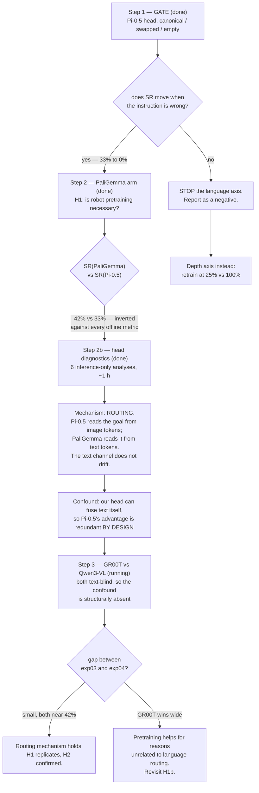

# Chapter 2 — from availability to necessity

Chapter 1 measured what published VLA backbones *contain*. This chapter tests
what a policy actually *needs*. Everything below is written so that each
experiment has a stated prediction and a stated way of being wrong.

Status of the analysis this rests on: `asset/analysis/latent_compare/report.html`
(43 pp), `tables.md`, and the JSON under the same directory. All numbers there
were regenerated after three measurement defects were found and fixed; the
frozen SmolVLA/SmolVLM2 pair now returns Δ 0.0000 / RSA 1.0000, which is the
correctness check the earlier version lacked.

**Where this chapter stands — COMPLETE (2026-08-10).** Four arms, two matched
pairs, one identical head.

| Exp | Backbone | Val loss | Canonical SR | Swapped |
|---|---|---|---|---|
| exp01 | Pi-0.5 (robot-pretrained) | 0.0356 | 33.0% | 0.0% |
| exp02 | PaliGemma-3B (its stock base) | 0.0528 | **42.0%** | 0.0% |
| exp03 | GR00T N1.7 (robot-pretrained) | **0.0316** | 62.5% | 0.0% |
| exp04 | Qwen3-VL-2B (its stock root) | 0.0332 | **68.0%** | 0.0% |

Three results, in order of how much they transfer beyond this study:

1. **Offline loss anti-predicts closed-loop success, 4 for 4** (r = −0.503).
   Within BOTH pairs the arm with the lower validation loss had the lower success
   rate. Choosing a VLA backbone by flow-matching loss would have picked the worse
   policy every time.
2. **Stock backbones match or exceed their robot-pretrained descendants**, in two
   independent architecture families (+9.0 and +5.5 points; pooled +7.2, p = 0.040).
3. **The instruction is load-bearing for all four** — 0/200 under a swapped
   instruction, every arm, every task.

H1b identifies the mechanism for pair 1 as **routing**, not representation quality
(`asset/analysis/head_diagnostics/head_diagnostics.json`). §8 validates the harness
itself: oracle-action replay tops out at ~90%, so exp04's 68.0% is 76% of ceiling
with a frozen backbone, one camera and 19.2M trainable parameters.

---

## 1. What Chapter 1 established

### 1.1 Robot pretraining does not reliably change the representation

Measured at each arm's documented read layer, against the exact checkpoint it
was built from:

| Pair | Δ task/scene | RSA to base | Δ η² instruction (image) |
|---|---|---|---|
| Pi-0.5 ← PaliGemma-3B | **+0.224** | **0.818** | **+0.523** |
| GR00T N1.7 ← Cosmos-R2 | +0.116 | 0.936 | −0.020 |
| Cosmos-R2 ← Qwen3-VL-2B | −0.038 | 0.974 | +0.007 |
| *SmolVLA ← SmolVLM2* | *−0.0000* | *1.0000* | *−0.0002* |

The SmolVLA row is a **null control**, not a result: its VLM is 345/345 tensors
identical to stock SmolVLM2, so it must read zero, and does. That fixes the
noise floor at ~0.000 and lets every other effect be sized against it.

Two of three published robot policies changed their VLM little or not at all.
The third changed it a great deal. So the honest claim is not "robot pretraining
does nothing" — it is that **the treatment label does not predict the outcome**.

### 1.2 Architecture gates what training can achieve

Same frames, different instruction, measure how far the image-token vector moves
(`text_visibility.py`, all conditions in one batch so padding is uniform):

| Arm | different instruction | same words scrambled | reading |
|---|---|---|---|
| **Pi-0.5** | **0.234** | 0.142 | tracks **meaning** (1.65×) |
| PaliGemma-3B | 0.042 | 0.047 | token-level only (0.90×) |
| Qwen3.5, SmolVLA, SmolVLM2, GR00T, Cosmos, Qwen3-VL | **0.0000** | 0.0000 | **cannot see the text** |

Six of eight are **bit-identical** under any text change: their image tokens are
produced before the instruction is attended to. GR00T is robot-trained and
structurally blind. Stock PaliGemma, with no robot data at all, is not.

The corresponding behavioural signature (`phase_split.py`): LIBERO-Goal's ten
tasks share one scene, so at frame 0 the image carries no task information.
Pi-0.5 reads η² = 0.873 there and stays flat across the whole episode
(0.873 / 0.868 / 0.868) — it knows the goal before it is visible. Every other arm
climbs from the noise floor, inferring the goal from the unfolding trajectory.

**Three tiers:** the attention mask decides whether the instruction can reach the
visual representation at all; the base model decides whether it does so at token
level; robot training converts that into sensitivity to what the sentence means.

### 1.3 Read depth

24 of 24 arm-datasets peak **below** the final layer; most peak at 25%.
PaliGemma peaks at **0%** on both ALOHA sets — its language decoder adds nothing
to action decodability that the vision tower and embedding table do not already
carry.

---

## 2. The design fact that shapes every experiment below

Our training cache is **272 tokens = 256 image + 16 text**, and the DiT head
cross-attends to the whole sequence. **The head therefore sees the text tokens
directly**, whether or not the backbone fused them into its image tokens.

So backbone blindness need not matter for our stack — the head can perform the
fusion itself. That turns Chapter 1's descriptive finding into a sharp question:

> **Is cross-modal fusion inside the backbone load-bearing, or can a downstream
> adapter recover it?**

Everything in this chapter is arranged to answer that.

**Answered, for the PaliGemma family (H1b).** The adapter recovers it — and the
recovered version is *better*. PaliGemma's head routes 23.8% of its
cross-attention to the instruction tokens and depends on them completely (2.76×
loss without them). Pi-0.5's head, handed a backbone that already fused the
instruction into its image tokens, routes only 4.2% there and is indifferent to
their removal (1.02×). The fused route is the one that degrades under closed-loop
distribution shift, because it lives in the channel that drifts.

This is the sense in which backbone fusion is not merely redundant but
counterproductive *for this stack*: it displaces a stable signal into an unstable
carrier. Whether that holds where no fused route exists at all is what exp03/exp04
test.

---

## 3. Hypotheses

### H1 — CONFIRMED, and inverted (2026-08-10)

*Original prediction:* SR(PaliGemma) ≥ 0.9 × SR(Pi-0.5) = 29.7%.
*Result:* **42.0%.** Cleared, and in the opposite direction to every offline
measure. 400 rollouts, 10 tasks × 2 conditions × 20 episodes, same 50 fixed
initial states as H3.

| | Pi-0.5 | PaliGemma |
|---|---|---|
| Probe action R² (raw, layer 18, image pool) | 0.403 | 0.282 |
| Probe action R² (**after the adapter**) | 0.497 | 0.290 |
| Best validation loss | 0.0356 | 0.0528 |
| Open-loop action correlation | 0.979 | 0.962 |
| **Canonical SR** | **33.0%** (66/200) | **42.0%** (84/200) |
| Swapped SR | 0.0% | 0.0% |

Two-proportion z = 1.87, p ≈ 0.062 — the defensible claim is *"stock PaliGemma
matches or exceeds Pi-0.5"*, not *"PaliGemma is better"*. PaliGemma wins 7 tasks,
loses 2, ties 1, and is far more uniform: its worst task is 10% against Pi-0.5's
three collapses at 0%, 5%, 5%.

**Robot pretraining of the VLM is not necessary for LIBERO-Goal.** The swapped
condition also returns 0/200 for PaliGemma, so H3's gate replicates on a second
backbone and is not a Pi-0.5 artifact.

### H1b — the mechanism (head diagnostics, 2026-08-10)

Six inference-only diagnostics on 2,000 held-out frames, identical for both arms
(`scripts/analysis/head_diagnostics.py`). They rule out the easy explanations and
identify a routing effect.

**The adapter is not the cause.** Pi-0.5's advantage *widens* through it —
raw +0.121 → adapted **+0.207**. Its representation is better by every offline
measure at every stage. The inversion is not about representation quality.

**The two arms learned different solutions:**

| | Pi-0.5 | PaliGemma |
|---|---|---|
| Cross-attention mass on the text tokens | **4.2%** | **23.8%** |
| Per-token attention, text ÷ image | 0.70× | **4.98×** |
| Loss when text tokens are zeroed | **1.02×** | **2.76×** |
| Adapted-token R², image pool | 0.497 | 0.290 |
| Adapted-token R², **text** pool | 0.332 | **0.379** |

Pi-0.5's head reads the goal out of the *image* tokens — its backbone fused
language into them (Chapter 1 meaning-sensitivity 0.234) — and is unaffected when
the instruction tokens are removed. PaliGemma's head reads the instruction
*directly*: its text tokens draw 5× more attention per token than its image
tokens, its text pool is more action-decodable than its image pool, and zeroing
them nearly triples its loss.

**Why the text route wins closed-loop.** The instruction tokens are constant and
drift-free — the same vectors at every timestep regardless of where the robot has
wandered. Pi-0.5's goal signal is entangled *into* the image tokens, so when a
rollout leaves the demonstration manifold the visual corruption takes the
instruction channel with it. Supporting evidence:

* Pi-0.5 has three collapse tasks (0%, 5%, 5%); PaliGemma's worst is 10%.
* Task-level **corr(Δloss, ΔSR) = −0.594** — PaliGemma wins biggest exactly where
  its offline loss is *closest* to Pi-0.5's.
* Within Pi-0.5, corr(loss, SR) = −0.451 (offline predicts online). Within
  PaliGemma, **+0.091** — decoupled, consistent with a robustness property that
  one-step loss cannot see.
* The extreme case, *"put the wine bottle on the rack"*: losses effectively tied
  (0.0680 vs 0.0672), SR **5% vs 70%**.

**Claim for the paper:** robot pretraining moved the instruction out of a stable
dedicated channel and into the visual representation. Offline that reads as an
improvement — it raises every decodability metric. Closed-loop it is a liability,
because the channel it moved into is the one that degrades under distribution
shift. That is *availability without necessity* with a named mechanism.

### H1c — fairness audit (both concerns closed)

**Positional-encoding asymmetry — not material.** The PE is concatenated at fixed
scale (std 0.54) before a shared LayerNorm, so its weight relative to content
differs 1.9× between arms (0.458 vs 0.239). Measured action sensitivity differs
only **1.13×** (0.152 vs 0.135) — far too small to explain 9 points of SR.

**Checkpoint selection — closed, and it runs against the result.** Open-loop
correlation plateaus after epoch 75 for both arms. PaliGemma's `best.pt`
(epoch 83, corr 0.9574) is *worse* than its `epoch_0100` (0.9609) and `final`
(0.9617), so best-val selection handed PaliGemma a slightly weaker checkpoint.
42% is if anything an underestimate.

Verified identical across arms: token layout, action/state normalisation
(byte-identical), dataset, epochs, batch, LR schedule, validation split
(`random_split` seed 42 on equal length), evaluation seed and the 20 initial
states per task. Raw feature scale differs (‖h‖ 53 vs 103) but is removed by the
adapter's input LayerNorm.

**Limitations.** The text and PE ablations evaluate trained heads
off-distribution — they measure *dependence* on an input, not achievable
performance without it. Task-level correlations are n = 10. The drift mechanism
is inference from converging evidence, not a controlled test.

### H1d — REPLICATED in a second family (2026-08-10)

exp03/exp04 repeat H1 where the confound above is structurally absent: GR00T and
Qwen3-VL are both text-blind (Chapter 1 text-visibility 0.0000), so our head must
supply fusion for BOTH, symmetrically. GR00T's documented read — one hidden state
at `select_layer=16` into a flow-matching head — is also what we actually built,
so the "you did not reproduce their architecture" objection does not apply here.

| Pair | Robot-pretrained | Stock base | Δ | z | p |
|---|---|---|---|---|---|
| PaliGemma family | Pi-0.5 **33.0%** | PaliGemma-3B **42.0%** | +9.0 | +1.87 | 0.062 |
| Qwen3-VL family | GR00T **62.5%** | Qwen3-VL-2B **68.0%** | +5.5 | +1.16 | 0.247 |
| **Pooled** | **47.8%** | **55.0%** | **+7.2** | **+2.06** | **0.040** |

H1 predicted SR(stock) ≥ 0.9 × SR(pretrained): pair 1 needed ≥29.7% and got 42.0%;
pair 2 needed ≥56.2% and got 68.0%. Both pass. Neither pair is individually
significant, so the claim is *"stock backbones match or exceed their robot-
pretrained descendants"* — the falsifier, pretraining leading by a wide margin,
is excluded in both families.

**The offline/online dissociation is 4 for 4.**

| Arm | Best val loss | Canonical SR |
|---|---|---|
| GR00T | **0.0316** (best) | 62.5% |
| Qwen3-VL | 0.0332 | **68.0%** |
| Pi-0.5 | 0.0356 | 33.0% |
| PaliGemma | 0.0528 (worst) | 42.0% |

r = **−0.503** across the four arms, and within BOTH pairs the arm with the lower
validation loss had the lower success rate. Selecting a backbone by offline
flow-matching loss would have chosen the worse policy every time. This is the
chapter's most transferable result: it is a warning about a metric the field
routinely uses for model selection.

**Gate replicates a fourth time.** exp04 swapped = 0/200, gripper changes 10.0 vs
6.0 canonical — the same signature as the other three arms. Four backbones, two
architecture families, identical collapse under a wrong instruction.

**Absolute performance is no longer the weak point.** Against the ~90% ceiling
measured by oracle-action replay (§8), Qwen3-VL reaches 76% of ceiling with a
frozen backbone, a single camera and 19.2M trainable parameters.

*Not* a controlled comparison: the two pairs differ in token budget (272 vs 88),
read depth and native resolution, so cross-pair claims (e.g. GR00T vs Pi-0.5) are
confounded. Only within-pair contrasts are controlled, which is why the design is
paired.

### H2 — Backbone fusion is cargo when the adapter can see text — ANSWERED

A text-blind backbone reaches comparable success, because the head reads the
text tokens itself.

*Prediction:* SR(blind arm) ≈ SR(PaliGemma) = 42%.
*Falsifier:* the blind arm is clearly worse → fusion inside the backbone is
load-bearing and Finding 7c has behavioural consequences.

**Sharpened by H1b.** The Pi-0.5/PaliGemma pair carries a confound a reviewer
will find: our head cross-attends to the text tokens directly, so Pi-0.5's
distinctive property is made redundant *by our architecture*. The diagnostics
measured exactly that asymmetry (4.2% vs 23.8% text attention).

GR00T (exp03) vs stock Qwen3-VL-2B (exp04) removes it. Chapter 1's
text-visibility test found GR00T, Cosmos and Qwen3-VL **all bit-identical** under
any instruction change (0.0000) — neither arm has backbone fusion for the head to
render redundant, so the head must supply it for both, symmetrically. The pair
therefore replicates H1 *and* tests H2 in one run.

Two further reasons it is the cleaner comparison:

* **GR00T's real architecture is ours.** `groot_n17_3b/config.json` sets
  `select_layer=16`: one hidden state at a chosen layer, feeding a flow-matching
  action head. The "you did not reproduce their architecture" objection applies
  to Pi-0.5's KV-consuming expert, not here.
* **The treatment is real.** GR00T does not freeze its backbone — 476/493 tensors
  differ from Cosmos, `tune_llm=True` — and Cosmos differs from Qwen3-VL in
  584/625. Comparing exp03 against exp04 spans both hops; the single hop
  GR00T←Cosmos (RSA 0.936, Δη² −0.020) is too weak to test alone.

*Prediction under H1b's routing mechanism:* with no fused channel available on
either arm, both heads take the text-token route, the SR gap is small, and both
land near or above 42%.
*Falsifier:* GR00T beats Qwen3-VL by a wide margin anyway → robot pretraining
helps for reasons unrelated to language routing.

**RESULT: prediction met on both counts.** The gap is 5.5 points (p = 0.247, not
distinguishable from zero) and both arms land far above 42% — 62.5% and 68.0%.
Backbone fusion is not required: the two arms whose image tokens are provably
blind to the instruction are the two BEST performers in the study, because the
head reads the instruction tokens itself.

Read carefully, this does not say fusion is harmful — the cross-pair comparison
is confounded by token budget and read depth. It says fusion is not NECESSARY,
which is what H2 asked.

Read depth: both at layer 16 — GR00T's documented `select_layer`, which is
*final* for its 16-layer stack but *intermediate* for Qwen3-VL's 28. HF applies
the final RMSNorm only to the last hidden state, so `models/vla.py::encode_vlm`
now applies it to intermediate reads; without that the pair would differ by
normalisation rather than weights, the same defect that made Chapter 1's
provably-identical SmolVLA pair read cosine 0.22 instead of 1.0.

### H3 — CONFIRMED (2026-08-10)

600 rollouts, 10 tasks x 3 conditions x 20 episodes, Pi-0.5 backbone + our DiT
head, LIBERO's 50 fixed evaluation initial states:

| condition | SR | vs canonical | moved | gripper changes |
|---|---|---|---|---|
| canonical | **33.0%** (66/200) | — | 100% | 11.4 |
| swapped | **0.0%** (0/200) | **-33.0%** | 100% | 13.5 |
| empty | **0.0%** (0/200) | **-33.0%** | 100% | 18.6 |

Zero successes in 200 episodes under a wrong instruction, across all ten tasks.
The policy is not freezing: it moves in every episode and actuates the gripper
MORE under corrupted instructions than under the correct one. It is acting, and
acting differently — consistent with executing the instruction it was given
rather than the task it is being scored on.

**The gate is open.** Language is load-bearing for this stack, LIBERO-Goal is a
valid language testbed, and H1/H2 are worth their GPU time.

Caveat on power: canonical SR is 33% (range 0-75% per task), well short of the
~90% published full VLAs reach. A total collapse is unambiguous at this
baseline; a partial one would not have been.

### H3 — original statement
Success degrades when the instruction is swapped or removed.

*Prediction:* SR(swapped) ≪ SR(canonical).
*Falsifier:* unchanged → the policy solves LIBERO-Goal from vision and
proprioception alone, **and the entire language axis is untestable in this
setup**. This is why it runs first.

---

### H4 — ALOHA: the LIBERO null does NOT generalise (2026-08-12)

H1 concluded "robot pretraining of the VLM is not necessary." That conclusion
now has to be stated **conditionally on task structure**, because the same
GR00T-vs-stock contrast on a bimanual 14-DOF embodiment reverses it.

*Pre-registered falsifier for the LIBERO null:* a venue inside GR00T's
pretraining distribution. Bimanual manipulation qualifies, so this test is
biased TOWARD finding a pretraining effect and a null here would have been
strong. It did not return a null.

**Headline, n = 400 per arm** — two independent 200-episode runs on disjoint
seed ranges (`--seed-offset 0` and `1000`; `envs/aloha_env.py` derives cube pose
from the episode seed alone, so without the offset a rerun replays the same 200
scenes and resamples only the policy's flow noise):

| Arm | Run 1 | Run 2 | Pooled | Wilson 95% CI |
|---|---|---|---|---|
| exp05 GR00T N1.7 | 60.0% | 62.5% | **61.25%** (245/400) | [56.4, 65.9] |
| exp06 Qwen3-VL-2B | 49.0% | 54.5% | **51.75%** (207/400) | [46.9, 56.6] |

Gap **+9.5 pts**, z = 2.71, **p = 0.0067** — clears the Bonferroni bar for the
~6 comparisons run in this chapter (0.05/6 = 0.0083). CIs do not overlap.

**The gap is one transition, not general competence.** ALOHA rewards
{1,2,3,4} = touch / lift / handover / success. `max_reward == 3` never occurs in
800 episodes (GR00T `{0:43, 1:15, 2:97, 4:245}`, Qwen `{0:30, 1:23, 2:140,
4:207}`), so the ladder is effectively touch → lift → handover:

| Stage | GR00T | Qwen3-VL | Δ | p |
|---|---|---|---|---|
| P(touch) | 89.2% | 92.5% | −3.3 | 0.11 |
| P(lift \| touch) | 95.8% | 93.8% | +2.0 | 0.22 |
| **P(handover \| lift)** | **71.6%** | **59.7%** | **+12.0** | **0.0009** |

The two early stages run *against* GR00T. This is not a uniform advantage — it
is localised to the one stage that bimanual pretraining plausibly covers, and
the localisation is tighter (p = 0.0009) than the top-line result.

### H4b — head diagnostics on ALOHA: offline sees nothing (2026-08-12)

Same battery as H1b, `--dataset aloha`. Between-arm difference (stock minus
pretrained, % of pretrained):

| Measure | Δ |
|---|---|
| velocity loss (overall) | +0.1% |
| velocity loss (mid phase, contains handover) | +1.9% |
| open-loop action error (nMAE, 14 dims) | −0.4% |
| PE sensitivity | +1.1% |
| attention mass on image | **−5.2%** |
| **closed-loop success rate** | **−15.5%** |

Four accuracy measures are flat against a gap the rollouts resolve at
p = 0.0067. This is the chapter's dissociation in its strongest form: not
"offline ranks them wrongly" (H1's r = −0.503) but **offline has no signal at
all**. The single offline quantity that moves is attention *allocation* — the
stock arm spends 5.2% less mass on image tokens and correspondingly more on text
tokens that carry zero information on this task. Correlational, one dataset;
the only surviving mechanistic candidate, not a finding.

**Two pre-registered predictions failed, and both failures were informative.**

1. *Predicted text ablation ≈ 1.00–1.05×; measured 1.14× (GR00T), 1.24× (Qwen).*
   The reasoning — a constant instruction carries zero task-discriminative bits —
   was right; the conclusion was not. Zeroing a constant input is still an
   off-distribution perturbation, so the metric has a **floor above 1.0** and
   ALOHA measures it. That is the control condition the LIBERO ablation never
   had, and it reinterprets every LIBERO number: against a ~1.2× floor,
   **Pi-0.5's 1.023× sits BELOW it** — it ignores its instruction more completely
   than a model whose instruction is constant. Sharpest single claim available.

2. *Predicted PE sensitivity ≥ LIBERO's; measured 0.038 vs 0.097–0.152, i.e.
   2.5–4× LOWER.* "Handover is spatial registration" is falsified. The likely
   cause is a component interaction worth reporting on its own: ALOHA acts in
   **joint space** with fully observable 14-DOF proprioception, so the head can
   source most of what it needs from state; LIBERO acts in **end-effector space**,
   where the target's image position is what the action is computed against.
   **Action space determines how much the policy uses vision.**

A third prediction (Qwen worse on left-arm dims) failed after a real defect was
fixed: `per_dim_error` hard-coded `.reshape(-1, 7)`, which on 14-DOF ALOHA does
not raise but silently interleaves two joints into every reported column. Now
reads `cfg.action_dim`. Corrected result: no arm-specific deficit. `d13` (+9.2%,
plausibly the left gripper) is 1 of 14 dims with no multiple-comparison control
and unverified column ordering — a lead for Discussion, nothing more.

### H4c — checkpoint ladder: what pretraining actually buys (2026-08-12)

The n = 400 numbers describe the ceiling only. The claim actually made for robot
pretraining in practice is sample efficiency, which needs the whole curve.
Six snapshots × 2 arms × 50 episodes, **paired**: every eval sees the same 50
cube poses (`--seed-offset 2000`), so scene difficulty cancels between
conditions and the small n is workable.

| Epoch | GR00T | Qwen3-VL | Gap | McNemar p |
|---|---|---|---|---|
| 25 | 8.0% | **0.0%** | +8.0 | 0.125 |
| 50 | 28.0% | **0.0%** | +28.0 | **0.0001** |
| 100 | 46.0% | 22.0% | +24.0 | 0.017 |
| 150 | 54.0% | 28.0% | +26.0 | 0.035 |
| 200 | 72.0% | 48.0% | +24.0 | 0.036 |
| 300 | 66.0% | 46.0% | +20.0 | 0.053 |

- **The stock backbone cannot do the task early at all** — 0/50 at epochs 25 and
  50 while GR00T is at 28%. p = 0.0001, the strongest point in the ladder.
- **Stock needs ~2× the training** to reach any given rate: 2.4× / 2.8× / 2.2× /
  1.9× at the 20/30/40/46% targets.
- **The gap does not close by epoch 300.** So "pretraining buys speed, not skill"
  is NOT supported — it buys both, with speed the larger effect.

**Anchor check, and the reason the ladder's magnitude is not quotable.** The
ladder's 50 paired scenes are a fixed sample, and evidently a slightly
unrepresentative one: ep300 reads GR00T 66.0% (anchor 61.25%, +4.8) and Qwen
46.0% (anchor 51.75%, −5.8). Each deviation is inside one SE (~6.7 pts), so
nothing is broken — but it means the ladder establishes the **shape** and the
n = 400 pooled runs establish the **magnitude (+9.5 pts)**. Do not quote +24.

**Untested observation:** both arms peak at epoch 200 and drop at 300, while
best-val-loss selected epochs 285 and 280. If that survives a higher-n test it is
a fourth instance of the offline/online dissociation — offline checkpoint
selection picking the wrong checkpoint for both arms. 72 vs 66 at n = 50 is
within noise and no paired test was run, so this is flagged, not claimed.

### Consequence for H1

H1's null stands **for LIBERO-Goal** and is now bounded rather than general:

> Robot pretraining of the VLM contributes nothing measurable on single-arm
> pick-and-place with two cameras (2.5 pts, p = 0.40, against a camera effect of
> +21 to +29 pts), and contributes a replicated +9.5 pts on bimanual handover,
> concentrated in one transition, plus roughly 2× training efficiency.

The unresolved confound, stated plainly: LIBERO and ALOHA differ on **six axes at
once** — language variation (10 instructions vs 1), DOF (7 vs 14), arms (single
vs bimanual), action space (end-effector vs joint), cameras (2 vs 1), and
distribution match to GR00T's pretraining corpus. Two datasets cannot separate
them. Any claim naming one axis as the cause is an interpretation, not a result,
and must be written as such.

---

## 4. Experiment matrix

Four backbones, one identical DiT head, two matched pairs.

| Exp | Backbone | Property under test | Read | Status |
|---|---|---|---|---|
| exp01 | Pi-0.5 | fused, meaning-sensitive | L18 | **done** — val 0.0356, SR **33.0%** |
| exp02 | PaliGemma-3B | its stock base, token-level | L18 | **done** — val 0.0528, SR **42.0%** |
| exp03 | GR00T N1.7 | robot-pretrained, text-blind | L16 | **done** — val 0.0316, SR **62.5%** |
| exp04 | Qwen3-VL-2B | its stock root, text-blind | L16 | **done** — val 0.0332, SR **68.0%** |

The two pairs answer the same question under opposite architectural conditions:
exp01/02 with a fused backbone available, exp03/04 with none. Chapter 1's
text-visibility scores are 0.234 / 0.042 for the first pair and 0.0000 / 0.0000
for the second.

Geometry differs between pairs and is matched *within* them: PaliGemma-family
arms use 272 tokens (256 image at 224²), Qwen3-VL-family arms 88 (64 image),
which is why exp03/04 caches are ~23 GB against ~71 GB.

Conditions: **canonical**, **near-paraphrase**, **far-paraphrase**, **swapped**,
**empty**. Training uses canonical only; the rest are held out entirely. Runs so
far have evaluated canonical and swapped.

---

## 5. Order of work

**Step 1 was a gate, not a formality.** Had success not moved under a swapped
instruction, steps 2 and 3 would have measured nothing about language. It moved
33% → 0%, and replicated at 42% → 0% on PaliGemma.

**Step 2b was added after step 2 inverted.** Rolling out more checkpoints would
have cost 6–8 GPU-hours and only described the gap more precisely; the six
inference-only diagnostics cost ~1 h and identified its cause.

---

## 6. Costs

Measured, not estimated, except where marked:

| Step | Wall | Disk |
|---|---|---|
| 1 — gate rollouts, 600 episodes | 1 h 10 m | — |
| 2 — PaliGemma precompute | **44 min** (23.9 samples/s) | 71 GB |
| 2 — PaliGemma train, 120 epochs | **4 h 02 m** (122 s/epoch) | — |
| 2 — H1 rollouts, 400 episodes | **1 h 11 m** | — |
| 2b — head diagnostics, 6 analyses | **~1 h** | 40 KB |
| 3 — exp03 precompute | **17 min** (70 samples/s) | 23 GB |
| 3 — exp04 precompute | **18 min** | 21 GB |
| 3 — exp03/exp04 train, 120 epochs | **~86 min each** (43 s/epoch) | — |
| 3 — exp03/exp04 rollouts, 400 each | **~70–79 min each** | — |
| 8 — harness validation, 100 replays | ~25 min | 40 KB |

The step-3 caches are ~3× smaller because Qwen3-VL-family processors emit 64
image tokens against PaliGemma's 256, giving an 88-token sequence rather than
272. Measured across the ten canonical instructions: 75–80 tokens, padded to 88
for the longer held-out paraphrase tiers.

The original 236-minute precompute estimate was wrong by 5×; the true rate is
23.9 samples/s. Estimates in this table marked *(est)* are scaled from that
measured rate.

---

## 7. What this chapter cannot settle

- **n = 4 backbones, 2 pairs.** Any cross-arm claim rests on four points.
- **Our head is not Pi-0.5's head.** Pi-0.5's action expert attends per-layer KV
  across all 18 layers; we read one hidden state at layer 18. At that layer
  nothing is lost — K and V are linear projections of the hidden state — but the
  aggregation over layers 1–17 is unavailable. Caching it was infeasible: 18 × 512
  dims per token is ~320 GB per arm against 71 GB. **This does not apply to
  exp03/exp04:** GR00T's documented read *is* a single hidden state at a selected
  layer, so our architecture is faithful to it.
- **The head can fuse language itself**, which makes backbone fusion redundant by
  construction. That narrows H1 to *"given an adapter that can fuse language, robot
  pretraining of the VLM adds nothing"* — and is precisely why exp03/exp04, where
  neither arm has fusion, were added.
- **Absolute success is low** (33–42% against ~90% for published full systems),
  which costs statistical power, not validity: both arms share an identical
  readout, and a floor cannot manufacture a gap favouring the untrained backbone.
  A null must be reported as *"no detectable difference at this readout capacity"*,
  never as equivalence. At n = 200 per condition the SE is 3.3%, so differences
  below ~9 points are not resolvable.
- **No absolute reference point.** We never ran a published system on this
  harness, so the harness itself (50 fixed init states, 400 max steps, 16/8
  receding horizon) is unvalidated against a known-good policy. Running official
  Pi-0.5-LIBERO would settle it; it needs a framework install and an 8–14 GB
  download, and it would add a ceiling rather than reduce bias in H1.
- **We do not contradict Pi-0.5's published results.** We never ran their system.
  Their paper claims the complete system works; it does not establish that its VLM
  pretraining is what produces that performance. That attribution is the
  assumption under test here.
- **LIBERO-Goal only.** ALOHA has one instruction and cannot test language;
  Language Table fails the decodability gate.
- **Success rate is not the only outcome.** Where a policy fails matters, and
  the rollout harness should record failure mode, not just a binary.

---

## 8. Is the harness itself correct?

Every offline number in this chapter comes from the precomputed cache, while
rollouts re-encode live. A mismatch between those paths — image convention, state
layout, action scaling, control mode, horizon — would degrade ONLY closed-loop
performance, which is exactly the signature the low absolute SRs show. So the
policy was removed from the loop entirely and the demonstrations' own recorded
actions were replayed through the same env construction, success detector and
step budget (`scripts/validate_harness.py`, 5 demos x 10 tasks x 2 conditions).

| replay condition | SR |
|---|---|
| no settling steps | **90.0%** (45/50) |
| 5 settling steps (as the policy rollout does) | **92.0%** (46/50) |

**The harness is correct**, and its ceiling coincides with the ~90% band
published methods report — so we are not evaluating on a stricter harness. The
residual ~10% is expected: open-loop replay of recorded actions through an OSC
controller is sensitive to MuJoCo version and platform drift since recording.
Tasks 5 (60%) and 3 (80%) replay worst, and those are also where every policy
does worst, so part of the per-task spread is intrinsic difficulty.

This makes the gap decomposable rather than mysterious:

| | SR |
|---|---|
| harness ceiling, oracle actions | ~90% |
| best arm (Qwen3-VL) | 68.0% |
| attributable to the ablation | ~22 points |

### What we removed relative to the published recipes

Audited against LeRobot's `configuration_pi0.py` / `configuration_pi05.py`, the
`policy_preprocessor.json` shipped in our own `pi05_base` checkpoint, and
`groot_n17_3b/config.json`:

**Deliberate — these ARE the experiment:**
* frozen VLM (they set `freeze_vision_encoder=False`, `train_expert_only=False`;
  GR00T sets `tune_llm/tune_visual/tune_projector/tune_diffusion_model` all True)
* action expert discarded; a 19.2M head replaces GR00T's ~403M diffusion head
  (32 layers x dim 1024)
* no image augmentation — a structural consequence of precompute, since the cache
  fixes the encoding (GR00T uses colour jitter + 0.95 random crop)

**Unforced, and worth fixing:**
1. **Single camera.** We read `agentview_rgb` only; the demos also contain
   `eye_in_hand_rgb`, and the published pipelines feed both. For manipulation the
   wrist view disambiguates the final centimetres of a grasp. Best single lever on
   absolute SR; ~3 h per arm.
2. **No action/state normalisation.** π₀ uses MEAN_STD, π₀.₅ uses QUANTILES; we
   train on raw actions (mean −0.161, std 0.438) while flow matching integrates
   from N(0,1).
3. **3 denoising steps** against LeRobot's 10 (GR00T: 4). Inference-only, free.
4. **Uniform timestep sampling**; π₀.₅ and GR00T both use a beta schedule.
5. **No EMA** (openpi uses 0.999); resolution 224² against GR00T's 256²/230 crop.

None of these threaten internal validity — every arm shares them identically, so
they lower the whole curve rather than favouring a backbone.

### Training budget is not the constraint

| | ours (each arm) | openpi π₀ on LIBERO |
|---|---|---|
| optimizer steps | **53,760** | 30,000 |
| batch | 128 | 32 |
| samples seen | **6,881,280** | 960,000 |
| passes over the training set | **120** | ~3.5 (all suites) |
| trainable params | 19.2M | ~3B |

We take 7.2x more samples and roughly 8–34x more passes over our data. Validation
flattens after epoch ~75 and open-loop action correlation reaches 0.979–0.997, so
the runs are optimisation-saturated. "Undertrained" is not an available
explanation; the binding constraints are informational (one camera) and
architectural (frozen backbone, small head).

---

## 9. The anatomy table

The study's organising question is not "is pretraining necessary" — that is one
row below. It is **which components of a VLA actually determine closed-loop
behaviour, and does the offline evidence rank them correctly?**

Each row states what was measured offline, what it did in closed loop, and how
exposed the inference is.

| # | Component varied | Offline signal | Closed-loop effect | Confidence |
|---|---|---|---|---|
| 1 | **Instruction channel** (canonical vs swapped) | eta^2 0.87 (Pi-0.5) to 0.07 (blind arms) | **decisive** — 33/42/62.5/68% -> 0/200 for all four arms | **high** — within-policy, 4 arms |
| 2 | **Head routing** (does the head read text itself?) | 1.02x / 2.76x / 7.05x / 7.41x loss when text zeroed | **r = +0.984 with SR** — the best predictor found | medium — n=4, cross-arm |
| 3 | **Backbone weights** (robot-pretrained vs stock) | largest offline effects in Ch.1 (RSA 0.818, delta-eta^2 +0.523) | **no advantage**: −9.0 and −5.5 points | **low** — single-view favours stock (§7) |
| 4 | **Validation loss** as a selector | the field's default criterion | **anti-predicts**, 4 of 4 within-pair, r = −0.503 | **high** — within-arm |
| 5 | **Adapter** (3.88M trained) | raises action R^2 (+0.094 for Pi-0.5) | *reduces* task silhouette (−0.098); creates no structure the backbone lacked (PaliGemma image pool +0.057 -> +0.071) | high |
| 6 | **Checkpoint choice** (best-val) | plateau after epoch ~75 | picks a WORSE checkpoint than `final.pt` for PaliGemma (0.9574 vs 0.9617) | high |
| 7 | **Positional encoding scale** | 1.91x asymmetry at the input | **1.13x** in behaviour — immaterial | high |
| 8 | **Action-dim scaling** (no normalisation) | dims differ 17x in std | rotation 1.6x worse than translation, uniformly; corr still 0.92–0.97 | high |
| 9 | **Read depth / tap type** | 24/24 peak below final layer; KV carries +0.098 R^2 over hidden | **not tested closed-loop** | — |
| 10 | **Harness** (oracle-action replay) | — | ~90% ceiling; matches the published band | high |

### The through-line

Rows 3, 4 and 5 say the same thing from three directions: **the offline evidence
does not rank components by closed-loop contribution.** The largest measured
representational difference in Chapter 1 (row 3) produced no closed-loop
advantage. The field's default selection metric (row 4) chose the worse policy
every time. The trainable adapter (row 5) improved the offline probe while
discarding the structure that probe was measuring.

Meanwhile the component that DID predict behaviour — row 2, whether the head
reads the instruction tokens itself — is not something any offline
representation metric in Chapter 1 was measuring. It only appears when you
ablate an input and watch what breaks.

**That is the anatomy claim: for this stack, closed-loop competence is
determined by where information is ROUTED, not by how much of it a
representation contains.**

### What each row can carry in a paper

* Rows 1, 4, 5, 6, 7, 8, 10 — **reportable as measured**. All within-arm or
  within-policy, so the single-view observation spec applies identically and
  cannot flip them.
* Row 2 — **report as a mechanism with a correlation, not an effect size.** n=4,
  cross-arm, and confounded by both the single-view spec and LIBERO-Goal's
  shared scene.
* Row 3 — **do not claim pretraining is unnecessary.** Report the numbers
  descriptively and state the observation-spec asymmetry (§7): the pretrained
  arms were trained multi-view and evaluated single-view, the stock arms were
  not, and the asymmetry runs in the direction of the result.
* Row 9 — future work; the KV tap and depth axis were measured offline only.

### Cheapest upgrades, if resource appears

1. **Second camera on the GR00T/Qwen3-VL pair** (~6 h, 74 GB) — removes the row-3
   asymmetry and tests whether row 2 survives a richer visual channel.
2. **Denoising steps 3 -> 10** (free, inference only) — raises all arms together.
3. **A second LIBERO suite** — tests whether rows 1 and 2 are inflated by the
   shared-scene design. Highest scientific value, highest cost.
