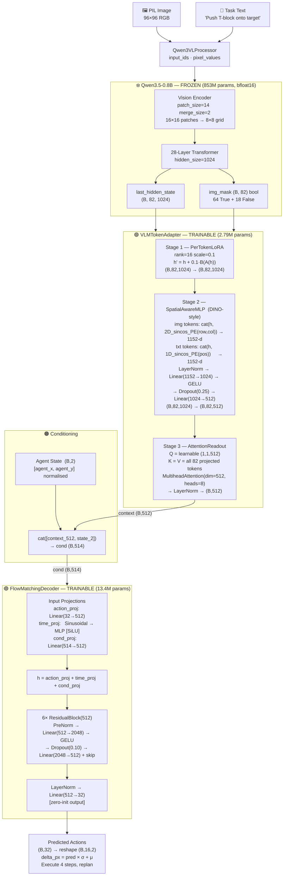
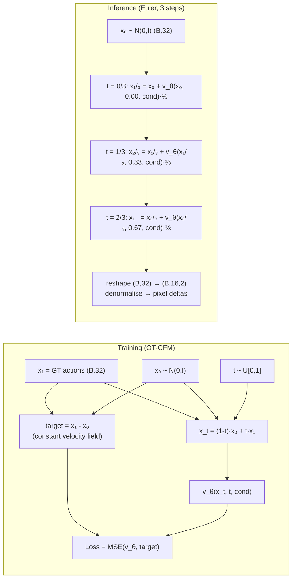
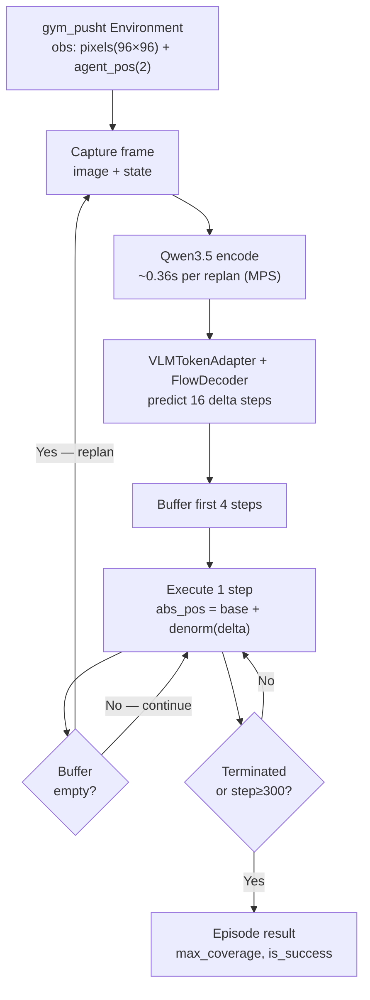
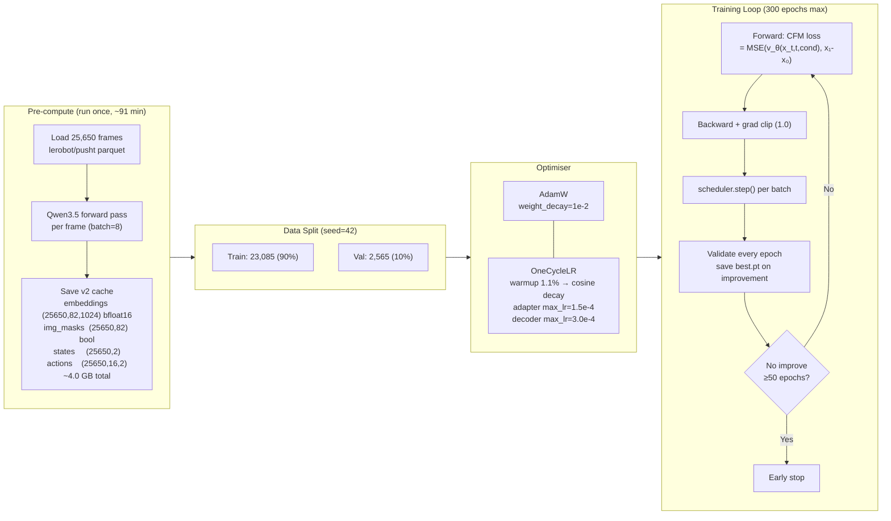
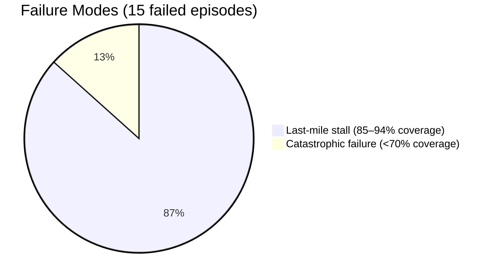
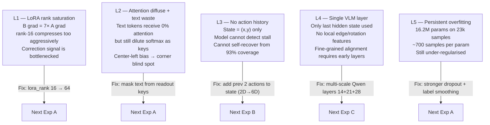

# Experiment 01 — VLA PushT: Frozen VLM + Per-Token Adapter + Flow Matching Decoder

**Date:** 2026-06-01
**Platform:** MacBook Pro M1 (MPS)
**Status:** ✅ Complete

---

## 1. Objective

Build a Vision-Language-Action (VLA) model for the PushT robotic manipulation task using:
- A **frozen** large vision-language model (Qwen3.5-0.8B) as the perception backbone
- A **trainable** lightweight token adapter to convert the VLM's full token sequence into a compact action-conditioning vector
- A **conditional flow matching decoder** to generate multi-step robot actions

**Golden Rule:** The frozen VLM weights must never be updated. No block position or goal position allowed in the state input.

---

## 2. System Architecture

### 2.1 Full Pipeline

### 2.2 Training vs Inference Flow

### 2.3 Receding-Horizon Control Loop

---

## 3. Configuration

| Parameter | Value | Notes |
|---|---|---|
| **VLM** | Qwen3.5-0.8B | Frozen, bfloat16 |
| **Token sequence** | 82 (64 img + 18 text) | 8×8 spatial grid |
| **LoRA rank** | 16 | Per-token, before pooling |
| **LoRA scale** | 0.1 | Residual magnitude |
| **Adapter dim** | 512 | Projection output |
| **Pos-enc dim** | 128 | 2D sinusoidal PE |
| **Readout heads** | 8 | AttentionReadout |
| **Adapter dropout** | 0.25 | Increased from 0.10 |
| **Decoder hidden** | 512 | Reduced from 768 |
| **Decoder layers** | 6 | Reduced from 8 |
| **Decoder dropout** | 0.10 | Increased from 0.05 |
| **Action horizon** | 16 steps | Trained prediction length |
| **Inference horizon** | 4 steps | Steps executed before replan |
| **Flow steps** | 3 | Euler integration steps |
| **Batch size** | 256 | Full-sequence v2 cache |
| **Learning rate** | 3e-4 (decoder) / 1.5e-4 (adapter) | OneCycleLR |
| **Weight decay** | 1e-2 | Increased 100× from 1e-4 |
| **Grad clip** | 1.0 | |
| **Early stopping** | patience=50 | Stopped at epoch 202 |
| **Trainable params** | 16,220,448 | 16.2M total |
| **Dataset** | 25,650 frames | lerobot/pusht |

---

## 4. Training Pipeline

### Training History (v1 → v3)

| Run | Key Change | Best Val Loss | Stopped At |
|---|---|---|---|
| v1 (old) | Mean-pool, adapter post-pool | ~0.51 | epoch 300 (no early stop) |
| v2 (this) iter 1 | Full token sequence, weight_decay=1e-4 | 0.4754 @ ep72 | Killed ep152 — overfitting |
| **v3 (this) iter 2** | weight_decay=1e-2, dropout 0.25/0.10, decoder 512×6 | **0.4490 @ ep152** | Early stop ep202 |

---

## 5. Results

### 5.1 Offline Evaluation (val set, 2,565 samples)

| Metric | Value |
|---|---|
| **Best val loss (CFM)** | 0.4490 |
| **MSE (normalised)** | 0.2398 |
| **MAE (normalised)** | 0.2946 |
| **L2 error — mean** | 9.33 px |
| **L2 error — median** | 6.7 px |
| **Directional accuracy** | **96.5%** |
| **Flow steps sensitivity** | 1 step ≈ 3 steps (linear OT flow) |

**Per-step L2 (px):**

| t+1 | t+2 | t+3 | t+4 | t+5–8 | t+9–16 |
|---|---|---|---|---|---|
| 9.55 | 8.88 | 8.33 | 8.14 ✅ | ~8.5–9.0 | 9.4–10.8 |

The model is most accurate at t+4 — the receding-horizon window was tuned correctly.

### 5.2 Simulation (20 episodes, gym_pusht)

| Metric | Value | Diffusion Policy paper |
|---|---|---|
| **Success rate** | **25% (5/20)** | ~60–70% |
| **Mean max coverage** | **87.2%** | ~78–82% |
| **Mean steps (success)** | 208.6 | — |
| **Mean steps (fail)** | 300.0 (timeout) | — |

**Failure mode breakdown:**

| Mode | Count | Coverage | Root cause |
|---|---|---|---|
| Last-mile stall | 13/15 | 85–94% | Cannot detect/correct block rotation in final alignment |
| Catastrophic | 2/15 | 28%, 54% | Block in corner/out-of-distribution initial position |

**The 13 stall failures were on average only 4% below the 95% success threshold.**

---

## 6. Analysis Findings

### 6.1 Attention Pattern

The AttentionReadout learned to allocate attention entirely to image tokens:

| Token type | Attention share |
|---|---|
| Image tokens (64) | **100.0%** |
| Text tokens (18) | **0.0%** |

Within image tokens, attention concentrates in the **center-left** (rows 3–5, cols 2–4 of the 8×8 grid) — where the T-block resides in most training frames. The corners receive <1% weight, creating a structural blind spot for unusual block positions.

### 6.2 Gradient Flow

| Component | Mean \|grad\| | Interpretation |
|---|---|---|
| LoRA A (compression) | 0.070 | Nearly saturated — rank bottleneck |
| LoRA B (expansion) | **0.532** | Heavily updating — wants more capacity |
| SpatialAwareMLP | 0.349 | Most active adapter layer |
| AttentionReadout | 0.194 | Actively learning query |
| Decoder (avg) | 0.210 | Well-distributed across blocks |

LoRA B gradient is **7× higher** than LoRA A — the rank-16 compression is the bottleneck.

### 6.3 Embedding Space

Neither the raw VLM embeddings nor the adapted embeddings are organised by agent position in PCA space. The model's spatial awareness comes **entirely from the visual content** of the image, not from the 2D state vector. The adapter expands variance into more PCA dimensions (~10 PCs for 80% variance vs ~5 PCs for raw VLM).

### 6.4 Flow Matching Quality

All 8 inspected denoising trajectories are **nearly perfectly linear** — confirming OT-CFM learned an optimal transport map with no curvature. 3 Euler steps and even 1 step give nearly identical results, consistent with a linear flow.

### 6.5 Overfitting

Despite stronger regularisation in v3 (weight_decay 100×, dropout 2.5×), a persistent generalisation gap remains:

| Epoch | Train loss | Val loss | Gap |
|---|---|---|---|
| 1 | 1.86 | 1.72 | 0.14 |
| 50 | 0.47 | 0.53 | 0.06 |
| 83 ★ | 0.39 | **0.4589** best | 0.07 |
| 152 ★ | 0.34 | **0.4490** best | 0.11 |
| 202 (stop) | 0.23 | 0.48 | 0.25 |

The gap widens monotonically after epoch ~80. The model has effectively memorised training frame-action pairs without fully generalising to unseen frames.

---

## 7. Identified Limitations

---

## 8. Proposed Next Experiments

### Experiment A — LoRA rank + attention masking *(Low effort, High impact)*

Target: L1 + L2

- `lora_rank`: 16 → 64
- Pass `key_padding_mask` for text token positions into `AttentionReadout` — exclude the 18 text tokens from key/value in every forward pass
- No precompute required (weights only change)

Expected gain: sharper spatial attention, richer per-token correction → improved last-mile alignment.

### Experiment B — Action history in state *(Medium effort, High impact)*

Target: L3

- Expand state from 2D → 6D: `[agent_x, agent_y, prev_Δx₁, prev_Δy₁, prev_Δx₂, prev_Δy₂]`
- Extract previous 2 executed deltas in the inference loop and append to state at replan time
- Update `config.state_dim = 6`, re-normalise, retrain

Expected gain: model can detect stall (same direction, no coverage gain) and switch strategy → directly targets the 13 near-miss failures.

### Experiment C — Multi-scale VLM features *(High effort, High impact)*

Target: L4

- Extract hidden states from Qwen layers 14, 21, and 28 (early, mid, late)
- Concatenate per-token: `(B, 82, 3072)` or project each to 512 then sum
- Re-run precompute to save 3-layer cache (~12 GB)

Expected gain: early layers encode local edges/textures useful for rotation detection; late layers encode semantics.

---

## 9. Conclusion

This experiment successfully built a working VLA pipeline for PushT using a frozen Qwen3.5-0.8B VLM. The model achieves **25% success rate** (5/20 episodes) and **87.2% mean max coverage** — significantly below the paper's 60–70% success rate but with a strong learned global strategy (96.5% directional accuracy).

The core bottleneck is the **last-mile alignment problem**: the model reliably gets the T-block to ~91% coverage but cannot cross the 95% threshold because fine-grained block rotation is not detectable from a center-biased, rank-16 corrected representation with no action history.

The two highest-ROI next experiments are **LoRA rank expansion** (saturated gradient bottleneck confirmed by data) and **action history** (stall detection impossible with current 2D state), which can be implemented independently and combined for the next training run.

---

## 10. File Index

| File | Purpose |
|---|---|
| `config.py` | All hyperparameters |
| `models/vla.py` | PerTokenLoRA, SpatialAwareMLP, AttentionReadout, VLMTokenAdapter, VLAModel |
| `models/flow_matching.py` | FlowMatchingDecoder, OT-CFM loss, Euler sampler |
| `data/pusht_dataset.py` | v1/v2 cache loader with img_mask support |
| `precompute_embeddings.py` | One-time Qwen forward pass → 4.0 GB v2 cache |
| `train.py` | Training loop, OneCycleLR, early stopping |
| `evaluate.py` | Offline metrics: L2, directional acc, per-horizon |
| `inference.py` | Receding-horizon gym_pusht simulation |
| `analysis.py` | 8-figure post-training analysis |
| `architecture_diagram.py` | Architecture + live data-flow diagram |
| `asset/result/checkpoints/best.pt` | Best checkpoint (epoch 152, val=0.4490) |
| `asset/result/vlm_embeddings.pt` | v2 embedding cache (4.0 GB) |
| `asset/result/analysis/` | All analysis figures |

---

*Generated from training run v3 · MacBook Pro M1 · MPS device · Early stopped epoch 202/300*
