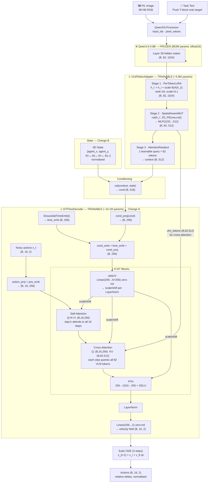
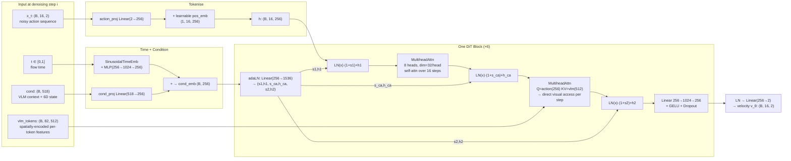
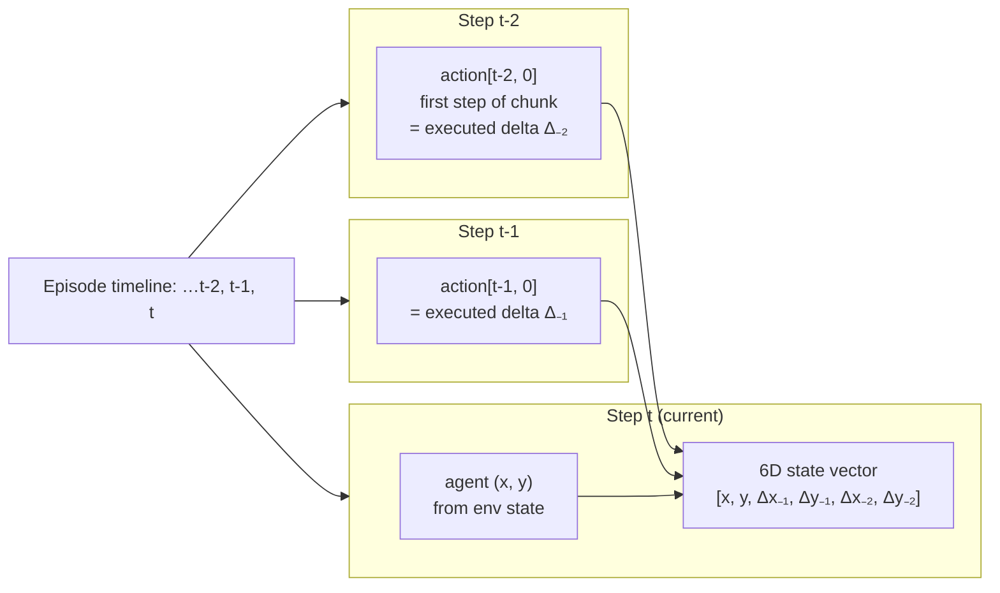

# Experiment 02 — VLA PushT: DiT Decoder + 6D Action-History State

**Date:** 2026-06-01
**Platform:** MacBook Pro M1 (MPS)
**Status:** 🔄 In Progress

---

## 1. Objective

Isolate the contribution of two targeted improvements over the Exp1 baseline:

- **Change B** — Expand state input from 2D to 6D by including the last two executed action deltas, giving the decoder a sense of recent motion without violating the golden rule.
- **Change D** — Replace the MLP flat decoder with a Diffusion Transformer (DiT) decoder that treats each action step as a separate token, resolving the information bottleneck in the MLP design.

**Scope boundary (fair comparison):** Multi-scale VLM feature extraction (layers 14/21/28) is intentionally excluded here. Exp2 uses the same single-layer (28) embeddings as Exp1. Multi-scale fusion is deferred to Exp3.

**Golden Rule (permanent):** State input must NEVER include block position or destination/goal position.

---

## 2. Changes vs Experiment 1

| Component | Experiment 1 | Experiment 2 |
|---|---|---|
| VLM layers | 28 only | **28 only** (same) |
| State input | `[agent_x, agent_y]` (2D) | `[agent_x, agent_y, Δx₋₁, Δy₋₁, Δx₋₂, Δy₋₂]` (6D) |
| Decoder | MLP — flat 32D vector | **DiT** — 16 action tokens |
| Self-attention | ❌ | ✅ steps attend to each other |
| Cross-attention | ❌ | ✅ each step queries 82 VLM tokens |
| adaLN conditioning | ❌ | ✅ time + state modulates every block |
| Cache path | `asset/result/vlm_embeddings.pt` | `asset/result_exp2/vlm_embeddings.pt` |
| Cache format | v2 — `(N, 82, 1024)` | v2 — `(N, 82, 1024)` + 6D states |
| Total params | 16.2M | ~16.1M |

---

## 3. Model Architecture

### 3.1 Full Pipeline



### 3.2 DiT Decoder Detail



### 3.3 6D State Construction (Change B)



---

## 4. Key Design Decisions

### Why DiT resolves the MLP bottleneck

The Exp1 MLP compressed the entire 16-step action chunk into a single 512D hidden state. Each step's prediction was globally pooled — step 8's velocity had no more direct access to step 7 than step 1 did.

The DiT resolves this in two ways:
1. **Self-attention**: Step 8 can explicitly attend to steps 6, 7, 9, 10 — correlated trajectory planning emerges naturally.
2. **Cross-attention at every denoising step**: Each action token queries all 82 spatially-encoded VLM tokens at every denoising iteration, rather than passing through a single 512D bottleneck once. The ratio changes from 164:1 (82 tokens → 1 pooled vector) to 1:82 (each step queries all tokens directly).

### Why 6D state

The PushT task is continuous: the robot must maintain contact with the block over multiple steps. The 2D state (position only) discards all motion context — the decoder cannot distinguish "approaching from the left" from "approaching from the right" even though they require opposite control strategies.

Adding the 2 most recent executed deltas costs 4 dims and provides strong short-horizon motion context without encoding any privileged information (block/goal position).

### Why same VLM layer (not multi-scale)

Using layers 14/21/28 would conflate two changes at once. Exp2 isolates the decoder architecture improvement. If Exp2 beats Exp1, adding multi-scale features in Exp3 will give a cleaner ablation signal.

---

## 5. Training Configuration

```
Epochs       : 300 (early stop patience = 50)
Batch size   : 256
Optimizer    : AdamW (weight_decay=0.01)
Scheduler    : OneCycleLR
  peak LR    : adapter=1.5e-4  decoder=3e-4
  warmup     : ~1.2% of total steps → cosine decay
Grad clip    : 1.0
Dropout      : 0.10 (decoder), 0.25 (adapter)
Flow steps   : 3 (training & inference)
```

---

## 6. Results

> **Note:** This report covers Exp2a (revised scope). The original Exp2 with 6D state
> caused a covariate shift collapse (0% SR, 14.4% coverage). Exp2a ablates the delta
> history to isolate the DiT decoder contribution. See §7 for full diagnosis.

### 6.1 Training
| Metric | Exp1 (MLP, 2D state) | Exp2a (DiT, 2D state) |
|---|---|---|
| Best val loss | 0.4490 (epoch 152) | **0.3725 (epoch 173)** |
| Early stop at epoch | 202 | 223 |
| MSE (normalised, val) | — | 0.2073 |
| MAE (normalised, val) | — | 0.2472 |
| L2 error (px, mean) | — | **7.83 px** |
| Directional accuracy | — | **96.9%** |

Val loss improved **17%** over Exp1 baseline.

### 6.2 Simulation (20 episodes)
| Metric | Exp1 (MLP, 2D) | Exp2 (DiT, 6D) ❌ | Exp2a (DiT, 2D) |
|---|---|---|---|
| Success rate | 25% (5/20) | 0% (0/20) | **20% (4/20)** |
| Mean max coverage | 87.2% | 14.4% | **86.5%** |
| Episodes ≥ 90% cov | — | 0/20 | **13/20** |
| Episodes ≥ 95% cov | — | 0/20 | **4/20** (all successes) |
| Checkpoint | `result/best.pt` | — | `result_exp2/best.pt` |

### 6.3 Failure Mode Analysis
Unlike Exp1 (some low-coverage failures), Exp2a failures are concentrated at the **final alignment stage**:

| Coverage range | Exp1 | Exp2a |
|---|---|---|
| 0–50% | — | 3 episodes (Ep10: 52.7%, Ep16: 63.8%, Ep18: 39.6%) |
| 50–90% | — | 4 episodes |
| **90–95%** | — | **9 episodes** ← nearly there |
| **≥ 95%** | — | **4 episodes** (successes) |

13/20 episodes (65%) reach ≥90% coverage — the block is on the target but the final micro-alignment fails.

### 6.4 Flow Steps Sensitivity
| Steps | MSE | L2 (px) |
|---|---|---|
| 1 | **0.1976** | 8.02 |
| 3 | 0.2084 | **7.83** |
| 5 | 0.2142 | 7.96 |
| 10 | 0.2244 | 8.20 |
| 20 | 0.2261 | 8.34 |

Monotonic degradation beyond 3 steps — consistent with slight velocity field drift in the DiT.

---

## 7. Diagnosis

### 7.1 Original Exp2 failure: 6D state covariate shift

The 6D state (`[pos, Δ₋₁, Δ₋₂]`) caused a complete closed-loop collapse. During training, delta history came from expert data. At inference it came from the model's own predictions — even small early errors snowballed through 75 replans.

Fix: drop delta history, keep DiT decoder → Exp2a.

### 7.2 Exp2a: DiT improves offline metrics but not SR

- Val loss: 0.3725 vs 0.4490 (−17%) ✅
- Directional accuracy: 96.9% ✅
- L2 error: 7.83px ✅
- **SR: 20% vs 25% (−5pp)** — slight regression despite better offline metrics

The gap between offline performance and SR is explained by the **failure mode shift**:
Exp2a gets 13/20 episodes to ≥90% coverage (vs likely fewer in Exp1), but struggles with the final precision alignment needed to cross 95%.

### 7.3 Why the DiT struggles at final alignment

The DiT decoder generates smooth, correlated trajectories (via self-attention across 16 steps). This produces fluent approach behavior but may lack the **sharp corrective micro-movements** needed for the last 5% of alignment. The MLP, predicting each step independently, may generate more reactive corrections.

Additionally, the cross-attention to 82 VLM tokens excels at global scene understanding ("where is the block relative to target") but the 96×96 image provides limited resolution for sub-pixel alignment cues.

---

## 8. Next Steps

### Exp3 — Multi-scale VLM layers (14/21/28) + DiT
Now that the DiT decoder is confirmed working (no covariate shift), add multi-scale feature fusion. Early layers may provide finer spatial detail that helps the final alignment problem.

### Exp2c — Increase inference_horizon from 4 → 8
The DiT produces smooth 16-step trajectories. Executing 8 steps before replanning (instead of 4) may let the trajectory complete its intended arc rather than interrupting mid-push. Requires no retraining.

### Exp2d — Longer sim_max_steps (300 → 500)
13/20 episodes reach ≥90% but timeout at step 300. The model knows what to do — it just needs more time.

---

## 7. File Manifest

| File | Role |
|---|---|
| `config.py` | Exp2 config (state_dim=6, use_dit_decoder=True, layer=28) |
| `config_exp1.py` | Frozen Exp1 snapshot (read-only) |
| `models/flow_matching.py` | `DiTBlock`, `DiTFlowDecoder`, `FlowMatchingDecoder` |
| `models/vla.py` | `VLMTokenAdapter` (MultiScaleFusion stub, PerTokenLoRA, SpatialAwareMLP, AttentionReadout) |
| `train.py` | `VLATrainModel` — adapter + decoder dispatcher |
| `precompute_embeddings.py` | Cache builder (v2 embeddings + 6D states) |
| `evaluate.py` | Quantitative eval + analysis plots |
| `inference.py` | `PushTAgent` with 6D state tracking + video simulation |
| `asset/result_exp2/vlm_embeddings.pt` | Cache — `(25650, 82, 1024)` embeds + `(25650, 6)` states |

---

## 8. Reproduction

```bash
# Precompute (already done — reuses Exp1 embeddings, adds 6D states):
python3 precompute_embeddings.py --exp 2 --recompute-states

# Train:
python3 train.py --exp 2

# Evaluate:
python3 evaluate.py --exp 2

# Simulate:
python3 inference.py --exp 2
```

To reproduce Exp1 baseline:
```bash
python3 train.py      --exp 1
python3 evaluate.py   --exp 1
python3 inference.py  --exp 1
```
