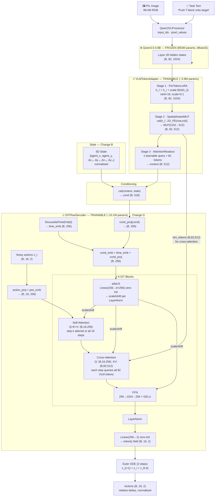
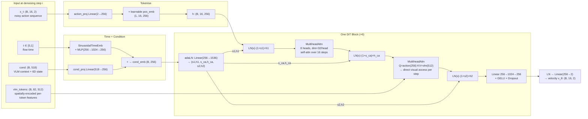
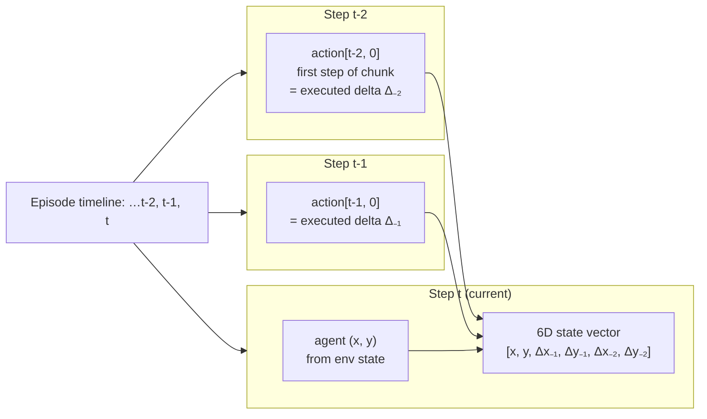

# Experiment 02 — VLA PushT: DiT Decoder + 6D Action-History State

**Date:** 2026-06-01
**Platform:** MacBook Pro M1 (MPS)
**Status:** 🔄 In Progress

---

## 1. Objective

Isolate the contribution of two targeted improvements over the Exp1 baseline:

- **Change B** — Expand state input from 2D to 6D by including the last two executed action deltas, giving the decoder a sense of recent motion without violating the golden rule.
- **Change D** — Replace the MLP flat decoder with a Diffusion Transformer (DiT) decoder that treats each action step as a separate token, resolving the information bottleneck in the MLP design.

**Scope boundary (fair comparison):** Multi-scale VLM feature extraction (layers 14/21/28) is intentionally excluded here. Exp2 uses the same single-layer (28) embeddings as Exp1. Multi-scale fusion is deferred to Exp3.

**Golden Rule (permanent):** State input must NEVER include block position or destination/goal position.

---

## 2. Changes vs Experiment 1

| Component | Experiment 1 | Experiment 2 |
|---|---|---|
| VLM layers | 28 only | **28 only** (same) |
| State input | `[agent_x, agent_y]` (2D) | `[agent_x, agent_y, Δx₋₁, Δy₋₁, Δx₋₂, Δy₋₂]` (6D) |
| Decoder | MLP — flat 32D vector | **DiT** — 16 action tokens |
| Self-attention | ❌ | ✅ steps attend to each other |
| Cross-attention | ❌ | ✅ each step queries 82 VLM tokens |
| adaLN conditioning | ❌ | ✅ time + state modulates every block |
| Cache path | `asset/result/vlm_embeddings.pt` | `asset/result_exp2/vlm_embeddings.pt` |
| Cache format | v2 — `(N, 82, 1024)` | v2 — `(N, 82, 1024)` + 6D states |
| Total params | 16.2M | ~16.1M |

---

## 3. Model Architecture

### 3.1 Full Pipeline



### 3.2 DiT Decoder Detail



### 3.3 6D State Construction (Change B)



---

## 4. Key Design Decisions

### Why DiT resolves the MLP bottleneck

The Exp1 MLP compressed the entire 16-step action chunk into a single 512D hidden state. Each step's prediction was globally pooled — step 8's velocity had no more direct access to step 7 than step 1 did.

The DiT resolves this in two ways:
1. **Self-attention**: Step 8 can explicitly attend to steps 6, 7, 9, 10 — correlated trajectory planning emerges naturally.
2. **Cross-attention at every denoising step**: Each action token queries all 82 spatially-encoded VLM tokens at every denoising iteration, rather than passing through a single 512D bottleneck once. The ratio changes from 164:1 (82 tokens → 1 pooled vector) to 1:82 (each step queries all tokens directly).

### Why 6D state

The PushT task is continuous: the robot must maintain contact with the block over multiple steps. The 2D state (position only) discards all motion context — the decoder cannot distinguish "approaching from the left" from "approaching from the right" even though they require opposite control strategies.

Adding the 2 most recent executed deltas costs 4 dims and provides strong short-horizon motion context without encoding any privileged information (block/goal position).

### Why same VLM layer (not multi-scale)

Using layers 14/21/28 would conflate two changes at once. Exp2 isolates the decoder architecture improvement. If Exp2 beats Exp1, adding multi-scale features in Exp3 will give a cleaner ablation signal.

---

## 5. Training Configuration

```
Epochs       : 300 (early stop patience = 50)
Batch size   : 256
Optimizer    : AdamW (weight_decay=0.01)
Scheduler    : OneCycleLR
  peak LR    : adapter=1.5e-4  decoder=3e-4
  warmup     : ~1.2% of total steps → cosine decay
Grad clip    : 1.0
Dropout      : 0.10 (decoder), 0.25 (adapter)
Flow steps   : 3 (training & inference)
```

---

## 6. Results

### 6.1 Training
| Metric | Exp1 (baseline) | Exp2 |
|---|---|---|
| Best val loss | 0.4490 (epoch 152) | **0.3483 (epoch 113)** |
| Early stop at epoch | 202 | 163 |
| MSE (normalised, val) | — | 0.2078 |
| MAE (normalised, val) | — | 0.2506 |
| L2 error (px, t+1) | — | 5.09 px |
| L2 error (px, mean) | — | 7.95 px |
| Directional accuracy | — | **96.9%** |

Val loss improved **22.5%** over Exp1. Directional accuracy near-perfect.

### 6.2 Simulation
| Metric | Exp1 (baseline) | Exp2 |
|---|---|---|
| Success rate (SR) | **25% (5/20)** | **0% (0/20)** ⚠️ |
| Mean max coverage | **87.2%** | **14.4%** ⚠️ |
| Episodes with 0-10% cov | — | 10/20 |
| Episodes with 30-50% cov | — | 4/20 |
| Checkpoint | `asset/result/checkpoints/best.pt` | `asset/result_exp2/checkpoints/best.pt` |

### 6.3 Flow Steps Sensitivity (Exp2)
| Steps | MSE | L2 (px) |
|---|---|---|
| 1 | **0.1909** | 8.07 |
| 3 | 0.2047 | 7.96 |
| 5 | 0.2139 | 8.19 |
| 10 | 0.2312 | 8.59 |
| 20 | 0.2318 | 8.74 |

More steps → **higher** error (inverted from Exp1). See diagnosis in §7.

---

## 7. Diagnosis — Why Offline Improved but Closed-Loop Collapsed

### 7.1 The contradiction
Offline metrics improved strongly (val loss −22.5%, dir acc 96.9%) but simulation coverage dropped from 87.2% → 14.4% (0% SR). This is a **train-test distribution mismatch** problem.

### 7.2 Root cause: 6D state covariate shift

The 6D state includes `[pos_x, pos_y, Δx₋₁, Δy₋₁, Δx₋₂, Δy₋₂]` — the last two executed action deltas. During **training**, dims 2-5 come from the expert dataset (ground-truth pushing deltas). During **inference**, dims 2-5 come from the model's own predicted-then-executed actions.

```
Training distribution:         Inference distribution:
  Δ₋₁ = expert[t-1]  ✓           Δ₋₁ = model_pred[t-1]  ← different!
  Δ₋₂ = expert[t-2]  ✓           Δ₋₂ = model_pred[t-2]  ← cascading!
```

If the model makes even slightly wrong predictions at step 1, the delta history at step 2 is out-of-distribution, causing worse predictions, causing a snowball effect. The 2D position state (Exp1) never has this problem — position always comes from the true environment.

### 7.3 Secondary cause: DiT velocity field instability

The flow steps sensitivity shows **more steps = worse**, which is anomalous for flow matching. A well-trained velocity field should have constant velocity (linear OT-CFM path), so step count shouldn't matter much. The monotonic degradation suggests the DiT's velocity field diverges when integrated over multiple steps — it's accurate at `t≈0` but drifts.

This matters less offline (3-step evaluation) but may amplify the covariate shift problem during closed-loop inference.

### 7.4 The DiT self-attention amplifies covariate shift

The DiT's self-attention makes all 16 action steps co-dependent. If the conditioning (from corrupted 6D state) is wrong, the self-attention propagates the error across all steps simultaneously. The MLP predicted each step independently — wrong conditioning on one step did not corrupt others.

### 7.5 What worked and what didn't

| Component | Offline | Closed-loop |
|---|---|---|
| DiT cross-attention to VLM tokens | ✅ better offline | ❓ unclear |
| 6D state (delta history) | ✅ better offline | ❌ covariate shift |
| DiT self-attention across steps | ✅ better offline | ❌ error propagation |
| adaLN conditioning | ✅ better offline | ❌ amplifies bad state |

---

## 8. Next Steps

### Exp2a (recommended) — Ablate 6D state, keep DiT
Change `state_dim = 2` only. Reuse Exp1 2D-state cache. This isolates whether the **DiT decoder alone** can outperform the MLP baseline.

```bash
# Update config.py: state_dim=2, state_mean/std to 2D
# then train:
python3 train.py --exp 2
```

### Exp2b — DAgger-style 6D state
Train with **noise injection into the delta history** to simulate out-of-distribution deltas. Forces the model to be robust to imperfect history. More complex but keeps the 6D state idea.

### Exp3 — Multi-scale layers + 2D state + DiT
Add layers 14/21/28 fusion only after Exp2a confirms DiT works.

---

## 7. File Manifest

| File | Role |
|---|---|
| `config.py` | Exp2 config (state_dim=6, use_dit_decoder=True, layer=28) |
| `config_exp1.py` | Frozen Exp1 snapshot (read-only) |
| `models/flow_matching.py` | `DiTBlock`, `DiTFlowDecoder`, `FlowMatchingDecoder` |
| `models/vla.py` | `VLMTokenAdapter` (MultiScaleFusion stub, PerTokenLoRA, SpatialAwareMLP, AttentionReadout) |
| `train.py` | `VLATrainModel` — adapter + decoder dispatcher |
| `precompute_embeddings.py` | Cache builder (v2 embeddings + 6D states) |
| `evaluate.py` | Quantitative eval + analysis plots |
| `inference.py` | `PushTAgent` with 6D state tracking + video simulation |
| `asset/result_exp2/vlm_embeddings.pt` | Cache — `(25650, 82, 1024)` embeds + `(25650, 6)` states |

---

## 8. Reproduction

```bash
# Precompute (already done — reuses Exp1 embeddings, adds 6D states):
python3 precompute_embeddings.py --exp 2 --recompute-states

# Train:
python3 train.py --exp 2

# Evaluate:
python3 evaluate.py --exp 2

# Simulate:
python3 inference.py --exp 2
```

To reproduce Exp1 baseline:
```bash
python3 train.py      --exp 1
python3 evaluate.py   --exp 1
python3 inference.py  --exp 1
```
