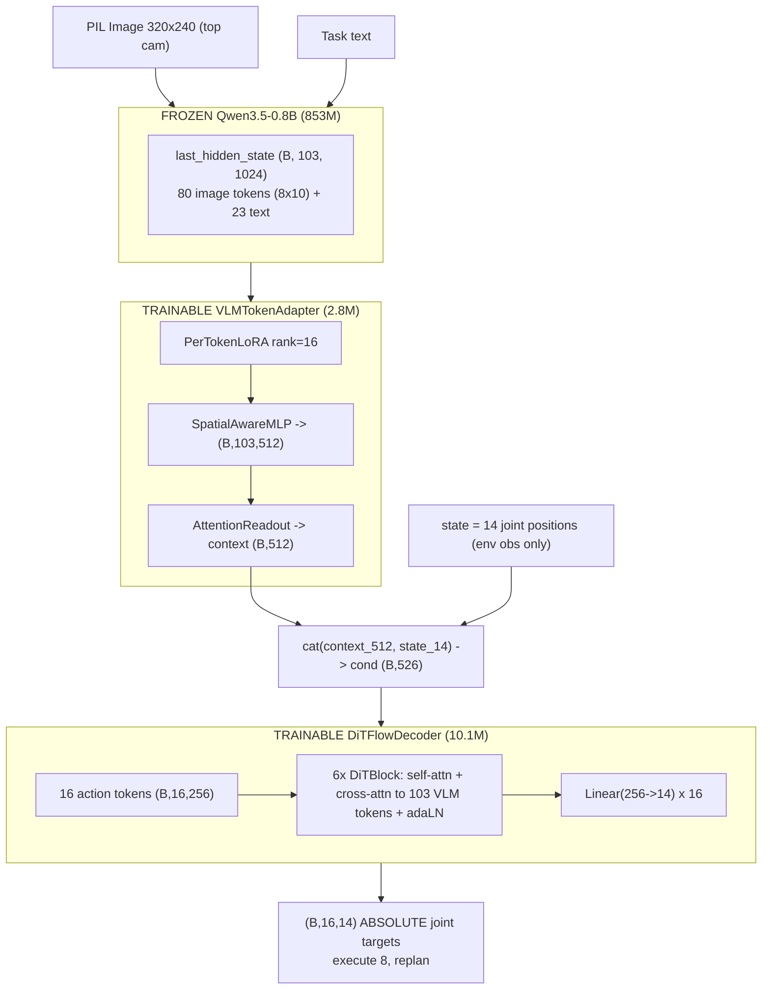

# Experiment ALOHA-01 — Baseline (Exp2a architecture → 14-DOF bimanual)

**Date:** 2026-06-04
**Platform:** Windows 11 · NVIDIA RTX 4070 Ti (CUDA 12.6, torch 2.7.1) · conda env `vla_aloha`
**Status:** ✅ Complete — n=50 sim eval done

> **Summary:** Carries the best PushT architecture (Exp2a: frozen Qwen3.5-0.8B + per-token LoRA adapter + DiT flow-matching decoder) over to the ALOHA bimanual transfer-cube task with **zero structural changes** — only the action/state dimensions (2→14), the image tokenisation, and the action representation change. At **n=50** the policy reaches **66.0% success rate (33/50), Wilson 95% CI [52%, 78%]** on `gym_aloha/AlohaTransferCube-v0`. This clears the Phase-2 gate ("non-trivial SR"): the architecture scales to high-DOF physical manipulation, and **rank-16 LoRA holds for the 14-D action space** (rank-64 not required).

---

## 1. Objective

**Phase-2 gate question:** Does the frozen-VLM → adapter → DiT pipeline scale from 2D planar pushing to contact-rich 14-DOF bimanual manipulation?
**Gate threshold:** Non-trivial, consistent task completion.
**Key architectural test:** Does LoRA rank-16 hold, or is rank-64 needed for the 14-D action space?

---

## 2. Setup

| Item | Value |
|---|---|
| Dataset | `lerobot/aloha_sim_transfer_cube_human` (v3.0) — 50 episodes, 20,000 frames, 50 fps |
| Task text | "Pick up the cube with the right arm and transfer it to the left arm." |
| Camera | single top camera, 480×640 → **resized to 320×240** |
| Sim env | `gym_aloha/AlohaTransferCube-v0`, `obs_type="pixels_agent_pos"` |
| Success | env reward == 4 (cube transferred to the left gripper and lifted) |
| Backbone | `Qwen/Qwen3.5-0.8B` (853M, frozen, bf16), `last_hidden_state` (24 layers) |

---

## 3. Changes vs PushT Exp2a

| Component | PushT Exp2a | ALOHA-01 |
|---|---|---|
| Action dim / State dim | 2 / 2 | **14 / 14** (6 arm joints + 1 normalised gripper, per arm) |
| Action representation | relative pixel deltas (integrated by agent) | **absolute joint targets** (commanded directly) |
| Image → tokens | 96×96 → 8×8 = 64 img tokens (seq 82) | 320×240 → **8×10 = 80 img tokens** (seq 103) |
| Normalisation | hard-coded pixel stats | per-joint mean/std from `meta/stats.json` |
| Decoder | DiT, hidden 256, 6 layers, 8 heads | **identical** |
| Adapter | PerTokenLoRA rank-16 + SpatialAwareMLP + AttentionReadout | **identical** |
| inference_horizon | 4 | **8** (absolute actions ⇒ no integration drift, so a longer open-loop window is safe) |
| Decoder params | 10.1M | 10.1M (only the action in/out projection width differs) |

Everything in the trainable stack (LoRA rank, adapter dim, DiT depth/width, flow steps) is unchanged — this is a clean test of whether the *same* architecture scales.

---

## 4. Architecture



**Trainable: 12.9M / 866M total (1.5%).** The frozen backbone is never touched.

---

## 5. Key engineering decisions

1. **Absolute joint targets, not relative deltas.** ALOHA's dataset `action` is the same 14-D space the env's `step()` consumes (6 arm joints in rad + 1 normalised gripper, per arm). Predicting absolute targets means the agent commands them directly with no integration — eliminating the open-loop drift that made PushT sensitive to `inference_horizon`. This is why `inference_horizon=8` is safe here.

2. **320×240 input → 80 image tokens.** Qwen's vision stack (patch 16, spatial-merge 2) maps 320×240 to an 8×10 merged grid (seq 103 with the 23 text tokens). This deliberately keeps the token budget close to PushT's 82, so the DiT cross-attention load matches the validated architecture. Native 480×640 would give 300 tokens (13 GB cache) — deferred as a resolution ablation.

3. **Hand-rolled data loader (not `LeRobotDataset`).** On this box, `LeRobotDataset.__getitem__` with the `pyav` backend **aliased global indices** (`ds[400]` returned frame 0), which would silently corrupt the precompute cache (duplicated ep0, missing ep49). The raw v3.0 layout is simple — one mp4 with all 20k frames in order (global index == frame position) plus 3 parquet shards — so [data/aloha/dataset.py](../../../data/aloha/dataset.py) reads it directly and verifiably (`ds[400]→ep1`, `ds[800]→ep2`).

4. **MuJoCo renders headless on Windows.** `dm_control`/`mujoco` 3.8 renders the top camera fine under the default GL backend on the RTX 4070 Ti — the main eval risk, cleared up front.

---

## 6. Training

| Setting | Value |
|---|---|
| Precompute | 20,000 frames → 4.2 GB bf16 cache, 9.4 min (35 samples/s) |
| Optimiser | AdamW, OneCycleLR (peak LR adapter 1.5e-4 / decoder 3e-4) |
| Batch size | 512 |
| Epochs | 300 (early-stop patience 50 — not triggered; val kept improving) |
| Best val loss | **0.0203** (flow-matching MSE), epoch 297 |
| Wall-clock | ~8.5 s/epoch, ~40 min total |

Training was data-bound, not compute-bound (GPU ~14% util / ~3.8 GB of 12 GB at batch 256), so batch was raised to 512 with no LR change.

---

## 7. Results (n=50)

```
Success rate      : 66.0%  (33/50)
Wilson 95% CI     : [52%, 78%]
Mean task progress: 78.5%   (reward / 4)
Mean steps        : 333 / 400
Horizon train/exec: 16 / 8
```

**Reward-stage distribution** (TransferCube reward is staged 0→4):

| Max reward | Meaning | Episodes |
|---|---|---|
| 0 | right gripper never touched the cube | 4 |
| 1 | right gripper touched, did not lift | 1 |
| 2 | right gripper **lifted** the cube | 12 |
| 3 | left gripper touched (handoff attempted) | 0 |
| 4 | **full transfer** (left holds, lifted) — SUCCESS | 33 |

---

## 8. Interpretation

- **Phase-2 gate: PASSED.** 66% SR is well above "non-trivial". The same frozen-VLM + adapter + DiT architecture that scored 56% on 2D PushT scores **66% on 14-DOF bimanual ALOHA** with no structural change.
- **Rank-16 LoRA holds for 14-D actions.** The Fix-A contingency (scale LoRA rank to action DOF) is **not needed** at this stage — a notable data point for H2. Rank-64 (ALOHA-B) becomes a confirmatory ablation rather than a fix.
- **Failure mode is the handoff, not grasping.** 45/50 (90%) lifted the cube with the right arm; 33 of those 45 (73%) completed the right→left transfer. Zero episodes stalled at reward 3, i.e. failures that reach the left arm almost always complete — the lost episodes are dropped/missed handoffs after a successful lift.

---

## 9. Decision gate

> Non-trivial SR with rank-16 → **architecture scales. Proceed.** Per RESEARCH.md, next candidates: ALOHA-B (rank-64 ablation — does rank matter for 14-D?), ALOHA-C (multi-camera: + wrist cameras), mechanistic analysis on ALOHA (does LoRA still dominate?), then Language Table.

---

## 10. Reproduce

```bash
# env: conda env `vla_aloha`; model + dataset resolved from the HF cache (offline).
# Windows note: run with PYTHONUTF8=1 (box-drawing chars in stdout) and HF_HUB_OFFLINE=1.

python scripts/precompute.py --dataset aloha --exp exp01            # 20k frames -> 4.2 GB cache (~10 min)
python scripts/train.py      --dataset aloha --exp exp01 --batch-size 512   # ~40 min, best val 0.0203
python scripts/evaluate.py   --dataset aloha --exp exp01 --episodes 50 --no-video   # 66% SR
```

Artifacts (gitignored under `asset/runs/aloha/exp01_baseline/`): `vlm_embeddings.pt`, `checkpoints/best.pt`, `sim_results.json`, `train.log`, `eval.log`.
