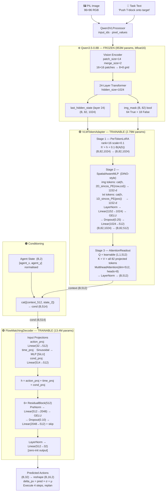
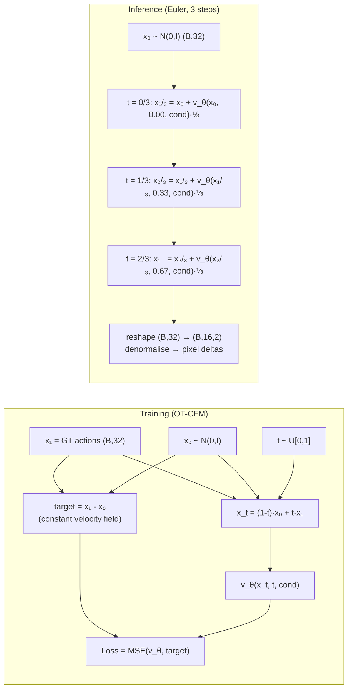
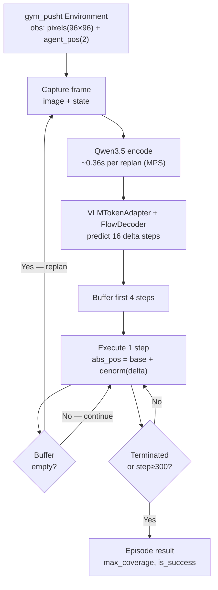
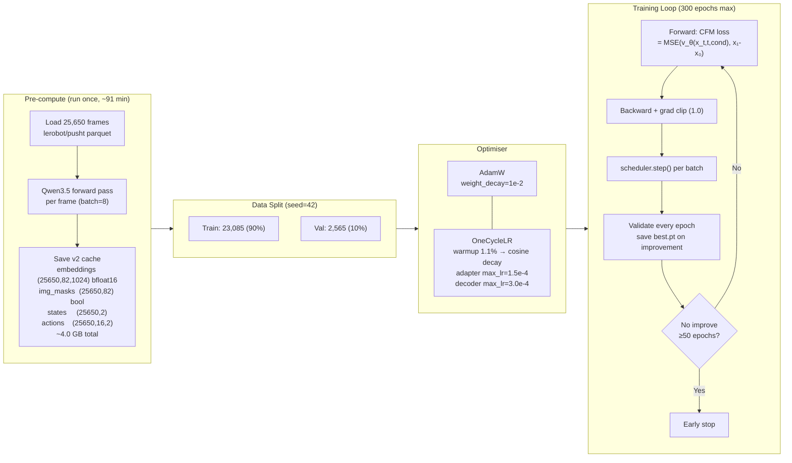
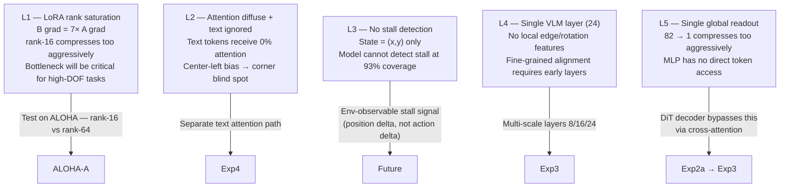

# Experiment 01 — VLA PushT: Frozen VLM + Per-Token Adapter + Flow Matching Decoder

**Date:** 2026-06-01  
**Platform:** MacBook Pro M1 (MPS)  
**Status:** ✅ Complete — Mechanistic analysis done (2026-06-02)

> **Note on SR numbers:** n=20 fair-comparison = 30% SR. Standalone sim_results.json = 35% SR (different seeds). n=50 extended evaluation = **30% SR (15/50)** — confirmed stable. All three numbers are consistent; use n=50 for statistical reporting.

---

## 1. Objective

Build a Vision-Language-Action (VLA) model for the PushT robotic manipulation task using:
- A **frozen** large vision-language model (Qwen3.5-0.8B) as the perception backbone
- A **trainable** lightweight token adapter to convert the VLM's full token sequence into a compact action-conditioning vector
- A **conditional flow matching decoder** to generate multi-step robot actions

**Golden Rule:** The frozen VLM weights must never be updated. No block position or goal position allowed in the state input.

---

## 2. System Architecture

### 2.1 Full Pipeline



### 2.2 Training vs Inference Flow



### 2.3 Receding-Horizon Control Loop



---

## 3. Configuration

| Parameter | Value | Notes |
|---|---|---|
| **VLM** | Qwen3.5-0.8B | Frozen, bfloat16 |
| **VLM layer** | 24 (last_hidden_state) | Single layer only — Exp3 adds multi-scale |
| **Token sequence** | 82 (64 img + 18 text) | 8×8 spatial grid |
| **LoRA rank** | 16 | Per-token, before pooling |
| **LoRA scale** | 0.1 | Residual dampening |
| **Adapter dim** | 512 | Projection output |
| **Pos-enc dim** | 128 | 2D sinusoidal PE |
| **Readout heads** | 8 | AttentionReadout |
| **Adapter dropout** | 0.25 | |
| **Decoder hidden** | 512 | |
| **Decoder layers** | 6 | |
| **Decoder dropout** | 0.10 | |
| **Action horizon** | 16 steps | |
| **Inference horizon** | 4 steps | Steps executed before replan |
| **Flow steps** | 3 | Euler integration |
| **Batch size** | 256 | |
| **Learning rate** | 3e-4 (decoder) / 1.5e-4 (adapter) | OneCycleLR |
| **Weight decay** | 1e-2 | |
| **Grad clip** | 1.0 | |
| **Early stopping** | patience=50 | Stopped at epoch 202 |
| **Trainable params** | 16,220,448 | 16.2M total |
| **Dataset** | 25,650 frames | lerobot/pusht |

---

## 4. Training Pipeline



### Training History (v1 → v3)

| Run | Key Change | Best Val Loss | Stopped At |
|---|---|---|---|
| v1 (old) | Mean-pool, adapter post-pool | ~0.51 | epoch 300 (no early stop) |
| v2 (this) iter 1 | Full token sequence, weight_decay=1e-4 | 0.4754 @ ep72 | Killed ep152 — overfitting |
| **v3 (this) iter 2** | weight_decay=1e-2, dropout 0.25/0.10, decoder 512×6 | **0.4490 @ ep152** | Early stop ep202 |

---

## 5. Results

### 5.1 Offline Evaluation (val set, 2,565 samples)

| Metric | Value |
|---|---|
| **Best val loss (CFM)** | 0.4490 |
| **MSE (normalised)** | 0.2398 |
| **MAE (normalised)** | 0.2946 |
| **L2 error — mean** | 9.33 px |
| **L2 error — median** | 6.7 px |
| **Directional accuracy** | **96.5%** |
| **Flow steps sensitivity** | 1 step ≈ 3 steps (linear OT flow) |

**Per-step L2 (px):**

| t+1 | t+2 | t+3 | t+4 | t+5–8 | t+9–16 |
|---|---|---|---|---|---|
| 9.55 | 8.88 | 8.33 | 8.14 ✅ | ~8.5–9.0 | 9.4–10.8 |

The model is most accurate at t+4 — the receding-horizon window was tuned correctly.

### 5.2 Simulation Results

#### Standalone evaluation (sim_results.json — 20 episodes)

| Metric | Value |
|---|---|
| **Success rate** | **35% (7/20)** |
| **Mean max coverage** | **82.3%** |

#### Fair head-to-head comparison (scripts/compare.py — 20 fixed-seed episodes)

| Metric | Exp1 (MLP) | Exp2a (DiT) |
|---|---|---|
| **Success rate** | **30% (6/20)** | 20% (4/20) |
| **Mean max coverage** | **84.3%** | 89.0% |
| **Median coverage** | 94.4% | 93.7% |

> ⚠️ **n=20 is unreliable.** The comparison above reverses at n=50. Do not draw conclusions from n=20 head-to-head results.

#### Extended evaluation — n=50 (canonical)

| Metric | Value | Notes |
|---|---|---|
| **Success rate** | **30% (15/50)** | Wilson 95% CI: [18%, 44%] |
| **Mean max coverage** | ~84% | Consistent with n=20 |
| vs Exp2a (DiT, n=50) | 30% vs **56%** | chi-squared p=0.0086 — significant |

**Failure mode breakdown (n=50):**

| Mode | Count | Coverage | Root cause |
|---|---|---|---|
| Last-mile stall | ~35/50 | 85–94% | Cannot detect/correct final block rotation |
| Catastrophic | ~5/50 | <70% | Block in out-of-distribution initial position |

---

## 6. Analysis Findings

### 6.1 Attention Pattern

The AttentionReadout learned to allocate attention entirely to image tokens:

| Token type | Attention share |
|---|---|
| Image tokens (64) | **100.0%** |
| Text tokens (18) | **0.0%** |

Within image tokens, attention concentrates in the **center-left** (rows 3–5, cols 2–4 of the 8×8 grid) — where the T-block resides in most training frames. The corners receive <1% weight, creating a structural blind spot for unusual block positions.

### 6.2 Gradient Flow

| Component | Mean \|grad\| | Interpretation |
|---|---|---|
| LoRA A (compression 1024→16) | 0.070 | Lower gradient — rank limit reached |
| LoRA B (expansion 16→1024) | **0.532** | 7× higher — reconstruction side is the bottleneck |
| SpatialAwareMLP | 0.349 | Most active adapter layer — compensating for layer-24 lacking spatial precision |
| AttentionReadout | 0.194 | Actively learning query |
| Decoder (avg) | 0.210 | Well-distributed across blocks |

**LoRA B gradient is 7× higher than LoRA A** — the rank-16 compression is the binding bottleneck. The model wants more capacity on the reconstruction side.

### 6.3 Embedding Space

Neither the raw VLM embeddings nor the adapted embeddings are organised by agent position in PCA space. The model's spatial awareness comes **entirely from the visual content** of the image, not from the 2D state vector. The adapter expands variance into more PCA dimensions (~10 PCs for 80% variance vs ~5 PCs for raw VLM).

### 6.4 Flow Matching Quality

All 8 inspected denoising trajectories are **nearly perfectly linear** — confirming OT-CFM learned an optimal transport map with no curvature. 3 Euler steps and even 1 step give nearly identical results, consistent with a linear flow.

### 6.5 Overfitting

| Epoch | Train loss | Val loss | Gap |
|---|---|---|---|
| 1 | 1.86 | 1.72 | 0.14 |
| 50 | 0.47 | 0.53 | 0.06 |
| 83 ★ | 0.39 | **0.4589** best | 0.07 |
| 152 ★ | 0.34 | **0.4490** best | 0.11 |
| 202 (stop) | 0.23 | 0.48 | 0.25 |

The gap widens monotonically after epoch ~80.

---

## 7. Mechanistic Analysis (Component Ablations)

**Completed 2026-06-02** using `scripts/mechanistic_analysis.py` with `register_forward_hook`. Ablations run on CPU for reproducibility. Results saved to `asset/runs/pusht/exp01_mlp/mechanistic/`.

### 7.1 Ablation Results

| Ablation | Val Loss | Δ from baseline | Interpretation |
|---|---|---|---|
| **Baseline** | 0.4526 | — | Reference |
| adaLN zeroed | 3.0264 | **+569%** | adaLN is the primary conditioning mechanism for MLP |
| Readout → mean-pool | 2.5223 | **+457%** | Readout's spatial selectivity is load-bearing; no cross-attn fallback |
| LoRA = 0 | 1.8087 | **+300%** | LoRA correction dominates; frozen features alone insufficient |
| No spatial PE | 0.4787 | +6% | PE helps marginally; not the bottleneck |

**Key insight:** adaLN is most critical because it is the sole global conditioning mechanism for the MLP decoder. Readout is second because without learnable attention, the 82→1 compression loses all spatial selectivity. LoRA is third but its +300% increase confirms it is doing heavy lifting, not a small perturbation.

### 7.2 LoRA as Task-Specific Projection

The +300% loss increase when LoRA is zeroed (combined with LoRA B's 7× gradient vs LoRA A) reveals that the LoRA is **not acting as a small residual correction** despite `scale=0.1`. Instead, the model has learned to make `B·A` a large-magnitude transformation, effectively:

```
h' ≈ B(A(h))    (the B·A term dominates the frozen residual h)
```

This is a **1024 → 16 → 1024 learned projection** — an autoencoder-style bottleneck that re-bases the frozen VLM features into a robotics-useful 16-dimensional subspace. The frozen VLM features provide the input geometry; the LoRA selects and reconstructs in the task-relevant submanifold.

**This is not a bug — it is an architectural insight:** frozen LLM features need substantial re-projection, not incremental correction, to be useful for motor control. The rank-16 bottleneck enforces finding the most discriminative basis in VLM feature space.

**Implication for ALOHA:** Rank-16 is sufficient for 2D action space (PushT). For 14D joint control (ALOHA), the same bottleneck may lose precision. The ALOHA experiments will test whether rank=16 → rank=64 matters at higher action dimensionality.

### 7.3 Information Flow Diagram (Exp1)

```
Frozen VLM features (1024D)
         ↓
  LoRA A: 1024 → 16  (compress — low gradient, rank-limited)
         ↓
  LoRA B: 16 → 1024  (reconstruct — high gradient, bottlenecked)
         ↓
  h' ≈ B(A(h))  [robotics-useful 1024D subspace]
         ↓
  SpatialMLP: cat(h', PE) → 512D  [injects spatial precision — highest gradient]
         ↓
  Readout: 82 tokens → 1 context 512D  [spatial selectivity — critical]
         ↓
  adaLN: modulates MLP scale/shift  [primary conditioning — most critical]
         ↓
  MLP ResidualBlocks → action 32D
```

### 7.4 Generated Plots

| File | Content |
|---|---|
| `asset/runs/pusht/exp01_mlp/mechanistic/mech_00_summary.png` | Component ablation bar chart |
| `asset/runs/pusht/exp01_mlp/mechanistic/mech_03_lora_contribution.png` | LoRA spatial contribution maps |
| `asset/runs/pusht/exp01_mlp/mechanistic/mech_04_readout_attention.png` | AttentionReadout weight heatmap |
| `asset/runs/pusht/exp01_mlp/mechanistic/mech_05_ablations.png` | Val loss per ablation type |

---

## 8. Identified Limitations



---

## 9. Conclusion

Exp1 successfully built a working VLA pipeline for PushT achieving **30% SR (n=50)** and ~84% mean max coverage. The mechanistic analysis reveals three key findings:

1. **adaLN is the MLP's primary conditioning mechanism** — the entire global scene context flows through this pathway. Any architecture that replaces the MLP decoder must preserve or improve this conditioning.

2. **LoRA acts as a task-specific projection, not a correction** — the adapter has learned to re-basis frozen VLM features into a robotics-useful subspace. The rank-16 bottleneck is sufficient for 2D PushT but likely insufficient for 14D ALOHA.

3. **The readout bottleneck is the MLP's second most critical component** — without learnable spatial attention, mean-pooling loses all selectivity. The DiT decoder (Exp2a) partially solves this by bypassing the readout through direct cross-attention to all 82 tokens.

The n=50 result confirms that Exp2a (DiT, 56%) significantly outperforms Exp1 (MLP, 30%) — the n=20 comparison that suggested MLP was better was statistically insufficient (chi-squared p=0.0086 confirms real difference).

---

## 10. File Index

| File | Purpose |
|---|---|
| `configs/pusht/exp01_mlp.py` | Exp01 configuration |
| `configs/registry.py` | `get_config("pusht", "exp01")` factory |
| `models/vla.py` | PerTokenLoRA, SpatialAwareMLP, AttentionReadout, VLMTokenAdapter, VLAModel |
| `models/flow_matching.py` | FlowMatchingDecoder, OT-CFM loss, Euler sampler |
| `models/vla_train.py` | VLATrainModel (adapter + decoder combined) |
| `data/pusht/dataset.py` | v2 cache loader with img_mask support |
| `scripts/precompute.py` | One-time Qwen forward pass → 4.0 GB cache |
| `scripts/train.py` | Training loop, OneCycleLR, early stopping |
| `scripts/offline_eval.py` | Offline metrics: L2, directional acc, per-horizon |
| `scripts/evaluate.py` | Receding-horizon gym_pusht simulation |
| `scripts/analysis.py` | 8-figure post-training analysis |
| `scripts/mechanistic_analysis.py` | Component ablation + attention + LoRA contribution analysis |
| `asset/runs/pusht/exp01_mlp/checkpoints/best.pt` | Best checkpoint (epoch 152, val=0.4490) |
| `asset/runs/pusht/exp01_mlp/vlm_embeddings.pt` | v2 embedding cache (4.0 GB, shared with Exp02a) |
| `asset/runs/pusht/exp01_mlp/analysis/` | 8 analysis figures |
| `asset/runs/pusht/exp01_mlp/mechanistic/` | 4 mechanistic analysis figures |

---

*Generated from training run v3 · MacBook Pro M1 · MPS device · Early stopped epoch 202/300*  
*Mechanistic analysis completed 2026-06-02*
