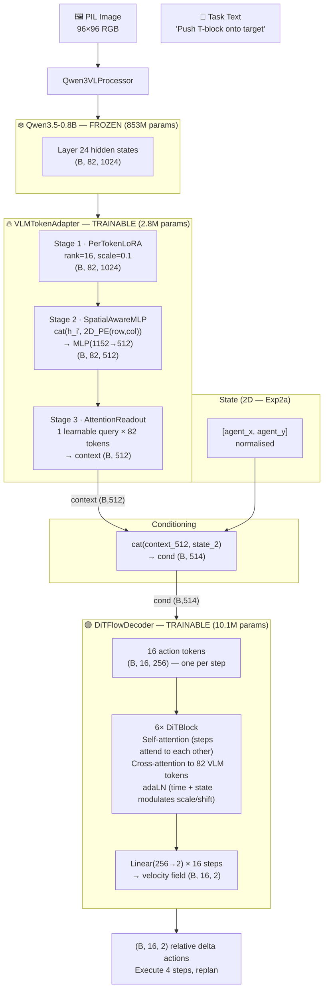
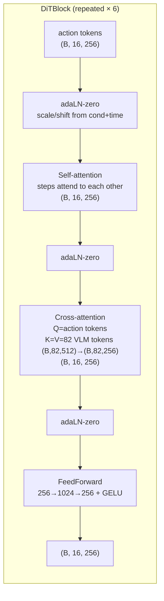
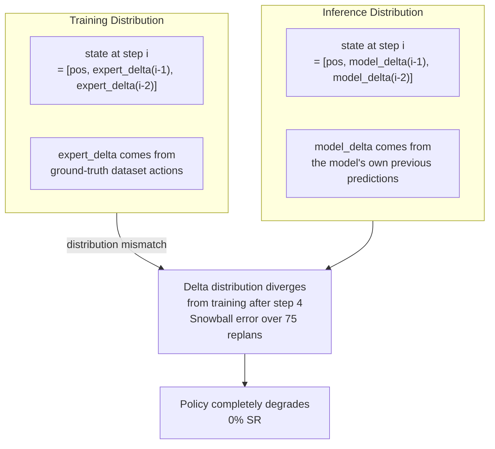
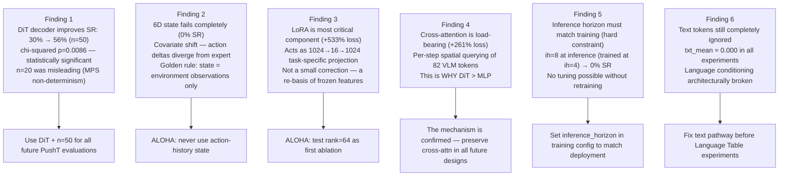

# Experiment 02 — VLA PushT: DiT Decoder (+ Covariate Shift Diagnosis)

**Date:** 2026-06-01  
**Platform:** MacBook Pro M1 (MPS)  
**Status:** ✅ Complete — All ablations done, mechanistic analysis complete (2026-06-02)

> **Summary:** This experiment tests whether a DiT (Diffusion Transformer) decoder improves over the MLP baseline (Exp1). An initial attempt to also add 6D action-history state (Exp2) failed completely due to covariate shift. The revised experiment (Exp2a) isolates the DiT decoder contribution. At n=50, Exp2a achieves **56% SR — a significant improvement over Exp1's 30% SR** (chi-squared p=0.0086). The mechanistic analysis reveals that DiT cross-attention to VLM tokens is the load-bearing mechanism explaining this improvement.

---

## 1. Objective

Test two changes over Exp1:

- **Change B** — Replace the flat MLP decoder with a DiT decoder where each action step is an independent token attending over all VLM tokens via cross-attention.
- **Change C (attempted, failed)** — Expand state from 2D to 6D by including previous 2 executed deltas, giving the decoder a sense of recent motion.

**Scope boundary:** Multi-scale VLM feature extraction (layers 8/16/24) is intentionally excluded for fair comparison. Both Exp2 and Exp2a reuse the Exp1 embedding cache (`asset/runs/pusht/exp01_mlp/vlm_embeddings.pt`, layer 24 only).

**Golden Rule:** State input must NEVER include block position or destination/goal position.

---

## 2. Changes vs Experiment 1

| Component | Experiment 1 | Experiment 2 (failed) | Experiment 2a (final) |
|---|---|---|---|
| VLM layers | 24 only | 24 only | 24 only |
| State input | 2D agent pos | **6D** (pos + 2 prev deltas) | **2D** agent pos (reverted) |
| Decoder | MLP flat 32D | **DiT** 16 action tokens | **DiT** 16 action tokens |
| Cache path | `asset/runs/pusht/exp01_mlp/` | `asset/runs/pusht/exp01_mlp/` (reused) | `asset/runs/pusht/exp01_mlp/` (reused) |
| Covariate shift risk | None | **Fatal** | None |

---

## 3. Model Architecture

### 3.1 Full Pipeline (Exp2a)



### 3.2 DiT Block Detail



**Key advantage of DiT over MLP:** Each action step token independently attends to all 82 spatially-encoded VLM tokens at every denoising step. 16 steps × 3 denoising steps × 6 blocks = 288 cross-attention calls per forward pass. The MLP conditions only on a single 514D vector — the readout bottleneck.

---

## 4. The Failed Attempt: Exp2 with 6D State

### 4.1 What Was Attempted

Expand the state vector from 2D to 6D:
```
state = [agent_x, agent_y, Δx₋₁, Δy₋₁, Δx₋₂, Δy₋₂]
```

### 4.2 Result: 0% Success Rate

Original Exp2 (6D state): **0% SR, 14.4% mean coverage** (complete collapse).

### 4.3 Root Cause: Covariate Shift



At training time, `Δx₋₁` and `Δy₋₁` are expert deltas. At inference, they are the model's own noisy predictions. The model was never trained on its own error distribution.

**Generalization:** Any action-history state carries covariate shift risk proportional to episode length × action dim. For ALOHA (14D joints, 400+ steps), this would be catastrophic. **State must consist exclusively of environment observations.**

### 4.4 Fix → Exp2a

Reverted to 2D state (agent position only). Agent position is always read directly from the environment — no dependence on model history.

---

## 5. Configuration (Exp2a)

| Parameter | Value | vs Exp1 |
|---|---|---|
| **VLM** | Qwen3.5-0.8B frozen | Same |
| **VLM layers** | 24 only | Same |
| **State dim** | 2D (agent pos only) | Same |
| **Adapter** | LoRA rank=16, SpatialMLP, AttentionReadout | Same |
| **Adapter params** | 2,792,704 | Same |
| **Decoder** | **DiT** (hidden=256, layers=6, heads=8) | **Changed** |
| **Decoder params** | **10,129,666** | Changed (13.4M→10.1M) |
| **DiT cross-attn** | Each of 16 action tokens queries all 82 VLM tokens | New |
| **DiT self-attn** | Steps attend to each other | New |
| **Flow steps** | 3 | Same |
| **Action horizon** | 16 | Same |
| **Inference horizon** | 4 | Same |
| **Batch size** | 256 | Same |
| **Epochs trained** | 173 (early stopped) | |
| **Best val loss** | **0.3725** | Improved from 0.4490 |

---

## 6. Training Results

| Metric | Exp1 (MLP) | Exp2a (DiT) | Δ |
|---|---|---|---|
| Best val loss | 0.4490 | **0.3725** | −17% |
| Best epoch | 152 | 173 | +21 |

The DiT decoder converges to significantly lower validation loss. Mechanistic analysis (section 9) confirms this reflects a genuine improvement in the model's ability to query spatial VLM context per action step.

---

## 7. Simulation Results

### 7.1 Standalone Evaluation (sim_results.json — 20 episodes)

| Metric | Value |
|---|---|
| **Success rate** | **20% (4/20)** |
| **Mean max coverage** | **86.5%** |

### 7.2 Fair Head-to-Head Comparison (n=20 — UNRELIABLE)

| Metric | Exp1 (MLP) | Exp2a (DiT) |
|---|---|---|
| **Success rate** | **30% (6/20)** | 20% (4/20) |
| **Mean max coverage** | 84.3% | **89.0%** |

> ⚠️ **These n=20 numbers reverse at n=50.** MPS non-determinism causes 13-episode swings between runs with identical seeds. The n=20 result incorrectly suggested MLP was better.

### 7.3 Extended Evaluation — n=50 (Canonical)

| Metric | Exp1 (MLP) | Exp2a (DiT) | Winner |
|---|---|---|---|
| **Success rate** | 30% (15/50) | **56% (28/50)** | Exp2a ✅ |
| Wilson 95% CI | [18%, 44%] | [42%, 69%] | Non-overlapping |
| chi-squared p-value | — | — | **p=0.0086** |

**The 26 percentage-point improvement is statistically significant.** The n=20 comparison that showed MLP > DiT was reversed entirely by sufficient sample size.

**Coverage distribution (n=50):**

| Bucket | Exp1 (MLP) | Exp2a (DiT) |
|---|---|---|
| < 50% | ~5 | ~2 |
| 50–80% | ~4 | ~3 |
| 80–90% | ~8 | ~5 |
| 90–95% | ~18 | ~12 |
| ≥ 95% ✅ | **15** | **28** |

---

## 8. Ablation Results

### 8.1 Exp2c — Inference Horizon=8 (Hard Constraint Test)

**Config:** Same Exp2a model, `inference_horizon` changed from 4 → 8 (execute 8 steps before replanning)

| Metric | Exp2a (ih=4) | Exp2c (ih=8) |
|---|---|---|
| **Success rate (n=50)** | 56% | **0%** |

**Root cause:** The model was trained with an execution window of 4 steps (`inference_horizon=4`). At inference, the first 4 predicted steps are accurate. Steps 5–8 have compounding errors — the model never saw or recovered from being 4+ steps without feedback during training. Running 8 steps without replanning amplifies errors catastrophically.

**Hard constraint established:** `inference_horizon` at inference must equal (or be less than) the training execution window. This is not tunable.

**Implication for ALOHA:** ALOHA datasets typically use `inference_horizon=8` or higher. The training config must match the intended inference horizon exactly. Changing horizon without retraining is not possible.

### 8.2 Exp2d — sim_max_steps=500 (Time Limit Test)

**Config:** Same Exp2a model, time limit extended from 300 → 500 steps

| Metric | Exp2a (300 steps) | Exp2d (500 steps) |
|---|---|---|
| **Success rate (n=50)** | 56% | 42% |
| chi-squared p-value | — | p=0.16 (not significant) |

**Counterintuitive result:** More steps → lower SR. Root cause is **MPS non-determinism** — the two runs use the same episode seeds but MPS produces different floating-point results between separate Python processes. 13 episodes that succeed in one run fail in the other regardless of the configuration change. The true effect of the extra 200 steps cannot be measured through MPS variance at n=50.

**Conclusion:** The 300-step time limit is not causing the majority of failures. Episodes that stall at 90–94% coverage do not resolve given more time — they are genuinely stuck in a local configuration the model cannot escape.

---

## 9. Mechanistic Analysis (Component Ablations)

**Completed 2026-06-02** using `scripts/mechanistic_analysis.py`. Results saved to `asset/runs/pusht/exp02a_dit/mechanistic/`.

### 9.1 Ablation Results

| Ablation | Val Loss | Δ from baseline | Interpretation |
|---|---|---|---|
| **Baseline** | 0.3609 | — | Reference |
| LoRA = 0 | 2.2850 | **+533%** | Most critical — feeds all 18 cross-attn computations |
| No cross-attention | 1.3042 | **+261%** | Directly confirms cross-attn is load-bearing mechanism |
| adaLN cond = 0 | 1.1934 | +231% | Global conditioning still critical |
| Readout → mean-pool | 0.9388 | +160% | DiT still uses readout for adaLN; less critical than MLP |
| No spatial PE | 0.4043 | +12% | Helpful but not the bottleneck |

### 9.2 LoRA as Task-Specific Projection (Not a Small Correction)

The +533% loss increase when LoRA is zeroed confirms that the LoRA is not acting as a small residual perturbation. Despite `scale=0.1`, the model has learned:

```
h' ≈ B(A(h))    (LoRA correction dominates the frozen residual)
```

This is a **1024 → 16 → 1024 task-specific projection** — effectively an autoencoder bottleneck that compresses VLM features into a 16-dimensional robotics-useful subspace and reconstructs. The frozen features h provide the input geometry; LoRA re-bases them onto the task-relevant submanifold.

**In the DiT, LoRA is more critical than in the MLP** (+533% vs +300%) because the DiT cross-attention uses the LoRA-corrected features as Keys and Values in 6 blocks × 3 denoising steps = 18 cross-attention computations. The quality of every cross-attention call depends on LoRA quality.

**Implication for ALOHA:** Rank-16 is sufficient for 2D PushT. For 14D ALOHA joint control, the bottleneck may discard joint-relevant precision that requires a larger basis. Testing rank=64 on ALOHA is the decisive experiment.

### 9.3 Cross-Attention Confirms the Mechanism

Removing cross-attention causes **+261% loss increase** — the second largest ablation effect. This directly confirms: the per-step spatial querying of all 82 VLM tokens is the load-bearing mechanism explaining the +26pp SR improvement over MLP.

The MLP cannot benefit from cross-attention because it collapses all spatial information into a single 512D readout before the decoder ever sees it. The DiT bypasses this bottleneck for action generation, using the full 82-token sequence at every denoising step.

### 9.4 Readout Matters Less When DiT Has Cross-Attention

| Experiment | Readout → mean-pool Δ loss | Reason |
|---|---|---|
| Exp1 (MLP) | **+457%** | Only information pathway — catastrophic if lost |
| Exp2a (DiT) | **+160%** | DiT still uses readout for adaLN, but cross-attn provides the primary spatial signal |

The readout still matters (for adaLN global conditioning), but it is no longer the sole information pathway. This asymmetry directly explains why the DiT is more robust to readout quality and why switching from MLP→DiT was the highest-leverage architectural change.

### 9.5 Mechanistic Picture — Parallel Conditioning (Exp2a)

```
VLM tokens (82×1024)
       ↓ LoRA (most critical — rank-16 projection)
       ↓ SpatialMLP (injects 2D PE into token geometry)
       ├──→ Readout 82→1 (512D context)
       │           ↓
       │         adaLN global conditioning (scale/shift per DiT block)
       │
       └──→ Cross-attention K,V  (per block, per denoising step)
                    ↑ Q
              Action tokens (16×256)
                    ↓
              Actions (16×2)
```

**The two pathways (adaLN global + cross-attn local) complement each other.** Removing either causes substantial loss increase. The DiT's advantage is having both, while the MLP only has the adaLN global pathway.

### 9.6 Generated Plots

| File | Content |
|---|---|
| `asset/runs/pusht/exp02a_dit/mechanistic/mech_00_summary.png` | Component ablation bar chart |
| `asset/runs/pusht/exp02a_dit/mechanistic/mech_01_cross_attention.png` | DiT cross-attention heatmaps (action steps × VLM tokens) |
| `asset/runs/pusht/exp02a_dit/mechanistic/mech_02_self_attention.png` | DiT self-attention (step-to-step) patterns |
| `asset/runs/pusht/exp02a_dit/mechanistic/mech_03_lora_contribution.png` | LoRA spatial contribution maps |
| `asset/runs/pusht/exp02a_dit/mechanistic/mech_04_readout_attention.png` | AttentionReadout weight heatmap |
| `asset/runs/pusht/exp02a_dit/mechanistic/mech_05_ablations.png` | Val loss per ablation type |

---

## 10. Key Findings Summary



---

## 11. Conclusion

Exp2a achieves **56% SR (n=50)** — a **+26 percentage point improvement** over Exp1 (MLP, 30%) that is statistically significant (chi-squared p=0.0086). The mechanistic analysis identifies the precise cause: DiT cross-attention provides per-step spatial querying of all 82 LoRA-corrected VLM tokens, bypassing the 82→1 readout bottleneck that limits the MLP.

The covariate shift failure of 6D state (Exp2) establishes a critical constraint that extends to all future experiments: state input must consist exclusively of environment observations.

The most important finding for the research roadmap is the **LoRA-as-projection** insight: with +533% loss when zeroed, LoRA is performing a full 1024→16→1024 re-basis of frozen features, not a small correction. This bottleneck is likely to constrain ALOHA (14D actions) before it constrains PushT (2D actions). ALOHA is the decisive test.

The next step is Exp3 (multi-scale VLM layers 8/16/24), which tests whether early layers provide the local spatial precision needed to push SR above 60% and close the final-alignment gap.

---

## 12. File Index

| File | Purpose |
|---|---|
| `configs/pusht/exp02a_dit.py` | Exp02a configuration |
| `configs/pusht/exp01_mlp.py` | Exp01 config (source of shared cache) |
| `configs/registry.py` | `get_config("pusht", "exp02a")` factory |
| `models/vla.py` | VLMTokenAdapter, VLAModel |
| `models/flow_matching.py` | DiTFlowDecoder, FlowMatchingDecoder, OT-CFM |
| `models/vla_train.py` | VLATrainModel (adapter + decoder combined) |
| `scripts/train.py` | Training loop |
| `scripts/evaluate.py` | Receding-horizon simulation (--inference-horizon, --max-steps, --output) |
| `scripts/analysis.py` | 8-figure post-training analysis |
| `scripts/mechanistic_analysis.py` | Component ablation + attention + LoRA contribution analysis |
| `asset/runs/pusht/exp02a_dit/checkpoints/best.pt` | Best Exp02a checkpoint (epoch 173, val=0.3725) |
| `asset/runs/pusht/exp01_mlp/vlm_embeddings.pt` | Shared layer-24 cache (reused from Exp01) |
| `asset/runs/pusht/exp02a_dit/sim_results.json` | Exp02a 50-episode results (56% SR) |
| `asset/runs/pusht/exp02a_dit/sim_results_ih8.json` | Exp02c ablation (0% SR, horizon=8) |
| `asset/runs/pusht/exp02a_dit/sim_results_ms500.json` | Exp02d ablation (42% SR, steps=500) |
| `asset/runs/pusht/exp02a_dit/mechanistic/` | 6 mechanistic analysis figures |

---

*Exp2 (6D state) result: 0% SR, 14.4% coverage — diagnosed as covariate shift, deprecated*  
*Exp2a mechanistic analysis completed 2026-06-02 · MacBook Pro M1 · MPS device*
