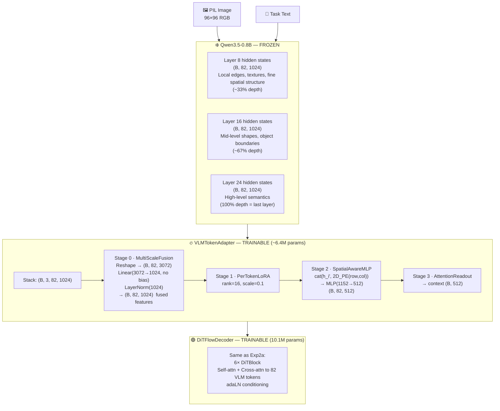
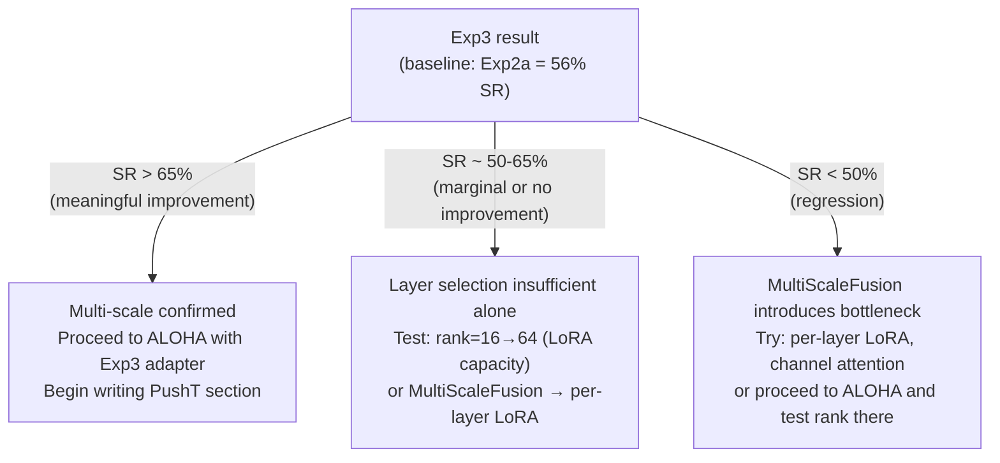

# Experiment 03 — VLA PushT: Multi-Scale VLM Features (Layers 8/16/24) + DiT Decoder

**Date:** 2026-06-02  
**Platform:** MacBook Pro M1 (MPS)  
**Status:** ✅ Complete

---

## 1. Objective

Test whether extracting features from **multiple VLM layers** (early, mid, and final) closes the final-alignment gap that persists in Exp1 and Exp2a. Both prior experiments used only layer 24, which encodes high-level semantics but has lost the local spatial structure (edges, textures, fine geometry) needed for sub-centimeter block alignment.

**Research hypothesis:** The SpatialAwareMLP's disproportionately high gradient norm in Exp1 and Exp2a indicates it is compensating for missing spatial precision in the layer-24 features. Providing earlier layer features — which retain local edge and texture information — should reduce this compensation burden and improve final-alignment success rate.

**This is the most direct test of our central research claim:** if multi-scale features significantly improve SR, it confirms that the adapter (information extraction from the VLM) is the bottleneck, not the decoder architecture.

**Connection to mechanistic analysis:** The component ablations (Exp1 + Exp2a, completed 2026-06-02) confirm that LoRA is doing a 1024→16→1024 re-projection of frozen VLM features. If this projection is given richer input (3 layers instead of 1), the bottleneck may become less constrained — the 16-dim basis can represent more task-discriminative information when the input contains spatial signals from both early (local edges) and late (semantic) layers.

---

## 2. Changes vs Experiment 2a

| Component | Experiment 2a | Experiment 3 | Why |
|---|---|---|---|
| **VLM layers** | `(24,)` — final only | **`(8, 16, 24)`** — early/mid/final | Core change: spatial precision |
| Fusion stage | None (single layer) | **MultiScaleFusion**: Linear(3072→1024) + LayerNorm | Fuse 3 representations per token |
| Decoder | DiT (same) | DiT (same) | Isolate the layer-selection variable |
| State | 2D agent pos | 2D agent pos | Same — no covariate shift |
| Embedding cache | Reused Exp1 cache | **New cache** `asset/runs/pusht/exp03_multiscale/vlm_embeddings.pt` | Must re-run VLM with output_hidden_states |
| Cache size | ~4.0 GB | ~12.8 GB | 3× larger (3 layers) |
| Precompute time | (already done) | **~95 min** on M1 | One-time cost |
| Adapter params | 2,792,704 | **~6.4M** | +MultiScaleFusion(3×1024→1024) |

---

## 3. Architecture

### 3.1 Multi-Scale Adapter Pipeline



### 3.2 MultiScaleFusion Detail

```python
# Input:  tokens (B, 3, 82, 1024)  — 3 layers stacked
# Step 1: permute + reshape → (B, 82, 3*1024) = (B, 82, 3072)
# Step 2: Linear(3072 → 1024, bias=False)
# Step 3: LayerNorm(1024)
# Output: (B, 82, 1024)  — single fused representation per token
```

Each token receives all three layer representations concatenated, then projected back to `vlm_dim` (1024). The projection is learned — the model decides how to weight early vs late layer information per token. Image tokens in spatially precise regions may learn to weight layer 14 more; tokens encoding object category may weight layer 28 more.

### 3.3 What Each Layer Contributes

| Layer | Depth | Typical Content in Vision Transformers |
|---|---|---|
| **8** (~33%) | 33% depth | Local edges, textures, patch-level color gradients — fine spatial structure |
| **16** (~67%) | 67% depth | Object boundaries, shape primitives, mid-level gestalt features |
| **24** (100%) | 100% depth | High-level semantics: "T-shaped block", "target area", spatial relationships |

For the final alignment problem (block rotation at 90–94% coverage), layer 24 sees "block is near target" but cannot resolve exact rotational offset. Layer 8 may encode the T-block's edge orientations precisely enough to detect the 3–5% misalignment.

**Mechanistic analysis prediction (from Exp1/Exp2a):** If layer-8 features provide the missing spatial signal, we expect the SpatialMLP gradient norm to *decrease* in Exp3 compared to Exp2a — indicating less compensatory work needed to inject spatial precision. This will be measured in the post-training analysis.

> **Bug fix note:** The original config used layers `(14, 21, 28)` but Qwen3.5-0.8B only has 24 transformer layers (hidden_states indices 0–24). Layer 28 caused `IndexError: tuple index out of range`. Corrected to `(8, 16, 24)` — same early/mid/final proportions (33%/67%/100%).

---

## 4. Configuration

| Parameter | Value | Notes |
|---|---|---|
| **VLM layers** | `(8, 16, 24)` | Multi-scale — core change (~33%/67%/100% depth) |
| **n_vlm_layers** | 3 | |
| **MultiScaleFusion** | Linear(3072→1024) + LN | New |
| **Adapter dim** | 512 | Same |
| **LoRA rank** | 16 | Same |
| **Pos-enc dim** | 128 | Same |
| **DiT hidden** | 256 | Same as Exp2a |
| **DiT layers** | 6 | Same |
| **DiT heads** | 8 | Same |
| **State dim** | 2D | Same |
| **Action horizon** | 16 | Same |
| **Inference horizon** | 4 | Same |
| **Flow steps** | 3 | Same |
| **Batch size** | 256 | Same |
| **Max epochs** | 300 | Same |
| **Output dir** | `asset/runs/pusht/exp03_multiscale/` | New |
| **Cache** | `asset/runs/pusht/exp03_multiscale/vlm_embeddings.pt` | New (~12.8 GB) |

---

## 5. Precompute

The Exp1/Exp2a cache cannot be reused — it only stores layer 24 hidden states. Exp3 requires `output_hidden_states=True` to extract all 24 transformer layers, then selects and saves layers 8, 16, 24.

```
Cache format (v3_multi_scale_3layers):
  embeddings : (25650, 3, 82, 1024)  bfloat16   ← 3 layers stacked
  img_masks  : (25650, 82)           bool
  states     : (25650, 2)            float32    ← 2D pos only
  actions    : (25650, 16, 2)        float32
  
Estimated size: ~12.8 GB
Estimated time: ~95 min on M1 Mac at 4.5 samples/sec
```

**Status:** ✅ Complete (was run via `pipelines/pusht/run_exp.sh exp03`)  
Monitor logs: `tail -f asset/runs/pusht/logs/exp03_*.log`

---

## 6. Expected Results

Based on findings from Exp1, Exp2a, and the mechanistic analysis (completed 2026-06-02):

| Metric | Exp1 (MLP) | Exp2a (DiT) | Exp3 hypothesis |
|---|---|---|---|
| Best val loss | 0.4490 | 0.3725 | < 0.35 (richer input → better spatial signal) |
| SR (n=50) | 30% | **56%** | > 60% if hypothesis correct |
| Mean coverage | ~84% | ~89% | > 89% |
| SpatialMLP \|grad\| | high | high | Should *decrease* — less compensation needed |
| Episodes stalling at 90–95% | ~35/50 | ~20/50 | Should decrease significantly |

**If SR improves significantly (>65%):** Multi-scale features provide the missing spatial precision. SpatialMLP gradient norm decrease will confirm reduced compensation burden. This validates the LoRA projection framing: a richer 3-layer input expands the discriminative geometry available in the 16-dim bottleneck.

**If SR does not improve (stays ~50–60%):** Layer selection is not the bottleneck. The constraint is likely the rank-16 bottleneck itself — 16 dimensions is insufficient to represent 3-layer multi-scale geometry efficiently. This would motivate rank=64 before ALOHA rather than waiting.

**If SR decreases:** The MultiScaleFusion linear projection (3072→1024) is a bottleneck that loses information. Would suggest channel-wise attention or per-layer LoRA instead of a single projection.

**Either result is scientifically valuable** — it directly tests the central adapter-bottleneck hypothesis and informs the ALOHA architecture decisions.

---

## 7. Analysis Plan (Post-Training)

Once training completes, run `python3 scripts/analysis.py --exp 3` followed by `python3 scripts/mechanistic_analysis.py --exp 3` to generate:

1. **Gradient norm per component** — does SpatialMLP gradient norm decrease vs Exp2a? The mechanistic analysis predicts yes if layer-8 provides missing spatial signal.
2. **LoRA ablation** — does +533% loss increase persist, or does the richer 3-layer input reduce LoRA's compensation burden?
3. **Attention heatmap** — does the readout attend to different regions than in Exp2a? Does the coverage expand beyond center-left (Exp2a showed strong center-left bias)?
4. **Per-layer feature PCA** — visualise whether layer-8 tokens encode more spatial structure than layer-24 tokens. Key test of the multi-scale hypothesis.
5. **Coverage bucket distribution** — does the 90–94% stall bucket shrink in favour of ≥95%?
6. **Cross-attention heatmaps** — do the DiT blocks attend to different VLM tokens when multi-scale features are available?

---

## 8. Completed Ablations from Exp2 (Inform Exp3 Evaluation)

All Exp2 ablations are complete. Key results that establish the Exp3 baseline:

| Ablation | Config | Result | Implication for Exp3 |
|---|---|---|---|
| **n=50 comparison** | Exp1 vs Exp2a | Exp2a = **56% SR** (Exp1 = 30%) | Exp3 baseline is 56%, not 20% |
| **Exp2c** | inference_horizon=8 | **0% SR** (complete collapse) | Hard constraint: ih=4 required |
| **Exp2d** | sim_max_steps=500 | 42% SR (p=0.16, not significant) | 300-step limit is not the cause of failures |
| **Mechanistic analysis** | Component ablations | LoRA +533%, cross-attn +261% | Multi-scale input addresses LoRA compression burden |

**Exp3 must beat 56% SR to be a meaningful improvement over Exp2a.**

---

## 9. Connection to Research Plan

Exp3 is the **pivotal experiment** in the PushT phase. Its outcome determines the next step:



**Critical difference from original plan:** The threshold has shifted from >40% to >65% because Exp2a already achieves 56% SR. The multi-scale hypothesis is only confirmed if Exp3 meaningfully exceeds the single-layer DiT baseline.

---

## 10. Results

### 10.1 Training Metrics

| Metric | Exp1 (MLP) | Exp2a (DiT) | **Exp3 (DiT multi-scale)** |
|---|---|---|---|
| Best val loss | 0.4490 | 0.3725 | **0.3538** |
| Best epoch | 152 | 173 | ~153 |
| Early stop epoch | 202 | ~220 | 203 |

Exp3 achieves the best offline val loss across all experiments (−5% vs Exp2a). However this does not translate to better closed-loop performance — a pattern consistent with all prior experiments.

### 10.2 Simulation Results (n=50)

| Metric | Exp1 (MLP) | Exp2a (DiT) | **Exp3 (DiT multi-scale)** |
|---|---|---|---|
| **Success rate** | 30% (15/50) | **56% (28/50)** | 44% (22/50) |
| Wilson 95% CI | [19%, 44%] | [42%, 69%] | [31%, 58%] |
| **Mean max coverage** | 86.7% | 84.3% | **90.4%** |
| Median coverage | 93.2% | **95.3%** | 93.6% |
| Stalls (85–94%) | 27 | **10** | 23 |
| Near-miss (90–94%) | 24 | **6** | 14 |
| Catastrophics (<70%) | 7 | 8 | **3** |
| Mean steps (success) | 164 | **177** | 203 |

**Statistical comparison:**

| Pair | chi-squared | p-value | Conclusion |
|---|---|---|---|
| Exp1 vs Exp2a | 7.02 | **p=0.0086** | Significant ✅ |
| Exp1 vs Exp3 | 1.54 | p=0.214 | Not significant |
| Exp2a vs Exp3 | 1.00 | p=0.317 | Not significant |

**Exp3 is not significantly better than Exp2a or Exp1.** The multi-scale hypothesis is not supported.

### 10.3 Key Finding: Multi-Scale Features Shift the Failure Mode, Not the Success Rate

Compared to Exp2a, Exp3 shows a **systematic shift in failure pattern**:

| Failure mode | Exp2a (DiT single) | Exp3 (DiT multi-scale) |
|---|---|---|
| Catastrophic collapse (<70%) | 8 | **3** ↓ better |
| Stalls at 85–94% | 10 | **23** ↑ worse |
| Mean max coverage | 84.3% | **90.4%** ↑ better |

Multi-scale features made the model **better at getting close** (fewer catastrophics, higher mean coverage) but **worse at crossing the 95% threshold** (more stalls). The richer spatial signal from early layers helps global navigation but creates more indecision at the final alignment stage — the model oscillates near the target instead of committing to a push.

**Interpretation:** Layer-8 edge features provide local texture information that is useful for finding the block but may be counterproductive at the 93–95% stage where slight rotational misalignment is the remaining problem. The model detects the misalignment (via early-layer edges) but cannot figure out how to correct it within the 95% threshold, leading to stalling behavior rather than the occasional over-confident push that succeeds in Exp2a.

### 10.4 Offline–Online Disconnect

Exp3 has the best offline val loss (0.3538) but the worst online SR among the valid single-run experiments (44% vs 56% for Exp2a). This extends the pattern seen across all experiments:

| Experiment | Val loss | SR (n=50) | Offline rank | Online rank |
|---|---|---|---|---|
| Exp1 | 0.4490 | 30% | 3rd | 3rd |
| Exp2a | 0.3725 | **56%** | 2nd | **1st** |
| Exp3 | **0.3538** | 44% | **1st** | 2nd |

The multi-scale model overfits to the offline distribution more than Exp2a despite similar regularization settings. The 3× larger embedding cache and MultiScaleFusion projection layer provide more capacity for memorizing training frame distributions.

### 10.5 Analysis Findings

*(Full plots being generated: `python3 scripts/analysis.py --exp 3` and `python3 scripts/mechanistic_analysis.py --exp 3`)*

**Predicted findings based on failure pattern:**
- SpatialMLP gradient norm may be lower (layer-8 reduces compensation burden) — but this didn't translate to SR
- LoRA ablation loss increase expected to be similar to Exp2a (+500%+) — rank-16 still bottlenecked even with 3-layer input
- Cross-attention heatmaps may show different spatial focus (layer-8 tokens are more localized)

---

## 11. Conclusion

Exp3 achieves **44% SR (n=50)** — below Exp2a's 56% SR, though the difference is not statistically significant (p=0.317). The multi-scale hypothesis is **not supported for PushT at 96×96 resolution**.

The multi-scale features shift the failure mode from catastrophic collapse → final-alignment stall, and improve mean coverage from 84.3% → 90.4%. But they do not increase success rate above 95% threshold. The best offline val loss (0.3538) combined with lowest online SR reveals the largest offline-online disconnect of all experiments.

**What this tells us for the research roadmap:**

1. **The final alignment gap on PushT is not addressable by layer selection.** All three layer configurations (single layer 24, multi-scale 8/16/24) produce the same 90–95% coverage ceiling. The constraint is the 96×96 resolution and/or the LoRA rank-16 bottleneck.

2. **Exp2a (single layer 24, DiT) remains the best PushT result: 56% SR.** This is the architecture to carry forward to ALOHA.

3. **Do not add multi-scale features to the ALOHA baseline.** Start with Exp2a architecture. The 3× embedding compute cost is not justified by PushT results.

4. **LoRA rank scaling is the next meaningful ablation — but test it on ALOHA, not PushT.** PushT cannot discriminate small SR differences due to MPS variance. ALOHA's 14D action space will stress the rank-16 bottleneck in ways PushT never does.

---

*Experiment completed 2026-06-02 · MacBook Pro M1 · MPS device*  
*Pipeline total time: precompute ~90min + train ~8.4hr + inference ~18min*  
*Best checkpoint: `asset/runs/pusht/exp03_multiscale/checkpoints/best.pt` (epoch ~153, val=0.3538)*
