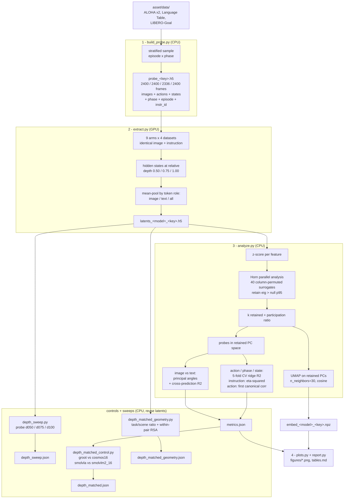

# VLA anatomy — Chapter 1: cross-backbone audit

Dissects three published VLAs against the exact checkpoints they were built
from, to establish which components a working VLA actually contains and which
of their representational differences are real.

**This chapter measures availability, not necessity.** Linear probes show that
information is present and linearly readable; they do not show a policy uses it.
This project has already seen the two diverge — a closed-loop ALOHA ablation
found image tokens carried the control signal while offline loss overstated the
text pathway. Necessity claims require ablate → retrain → roll out (Chapter 2).

## Arms

| Arm | Source | Role |
|---|---|---|
| `qwen` | `Qwen/Qwen3.5-0.8B` | the project's own frozen backbone |
| `pi05` | `lerobot/pi05_base` | robot-finetuned PaliGemma-3B |
| `paligemma` | `google/paligemma-3b-pt-224` | **stock control** for `pi05` |
| `smolvla` | `lerobot/smolvla_base` | robot-finetuned SmolVLM2-500M (16 layers) |
| `smolvlm2` | `HuggingFaceTB/SmolVLM2-500M-Video-Instruct` | **stock control** for `smolvla` |
| `groot` | `nvidia/GR00T-N1.7-3B` | robot-finetuned Cosmos-Reason2-2B (16 of 28 layers) |
| `cosmos` | `nvidia/Cosmos-Reason2-2B` | **stock control** for `groot` (28 layers) |
| `cosmos16` | the same weights, truncated to 16 layers | **depth-matched control** for `groot` |
| `smolvlm2_16` | SmolVLM2 truncated to 16 layers | **depth-matched control** for `smolvla` |

## Datasets

| Key | Frames | Role |
|---|---|---|
| `aloha_transfer` / `aloha_insertion` | 2,400 each | motor anatomy — strong action signal (R² 0.67–0.79) |
| `libero_goal` | 2,400 | **language anatomy** — 10 goals over a fixed scene, so language is the only disambiguating signal |
| `language_table` | 2,336 | a documented negative: no action signal for any arm (≤0.063) |

`libero_goal` was admitted by the gate Finding 1 recommends — *is the action
linearly recoverable by any encoder before committing GPU time?* It scores
0.26–0.40, about 10× Language Table and about 40% of ALOHA: a real testbed, not
an easy one. Language Table is retained as a result rather than a testbed.

**Why `groot` needs two controls.** GR00T changed two things about its base at
once: it finetuned the weights on robot data *and* deleted the top 12 of 28
language layers. Comparing GR00T's last layer (16) against stock Cosmos's last
layer (28) therefore confounds "what robot finetuning did" with "what reading 12
layers earlier does". `cosmos16` is the same stock weights truncated to exactly
GR00T's depth, so the pair differs in the finetuning and nothing else — same
width, same depth, same tokenizer, same image budget. Verified rather than
assumed: `cosmos16` grafts **494 tensors, 0 missing, 0 unexpected** — the exact
tensor count GR00T's own graft produces — and both tokenize the probe to
identical 77-token sequences with 54 image tokens.

This makes GR00T the **best-controlled pair in the study**. SmolVLA carries
precisely the confound `cosmos16` removes (16 layers vs SmolVLM2's 32), and
`depth_matched_control.py` quantifies how much that matters.

**One asymmetry to keep in mind when reading the GR00T pair.** Cosmos-Reason2-2B
is itself post-trained from `Qwen/Qwen3-VL-2B-Instruct` on physical-AI reasoning
data (robotics, self-driving, spatial). So `groot` vs `cosmos` isolates
*robot-action finetuning applied on top of a physical-reasoning base* — a
narrower question than `pi05` vs `paligemma`, where the control is a general
captioning VLM. The pairs answer related but not identical questions and should
not be pooled without saying so.

**Why the controls exist.** Comparing frozen-Qwen directly against Pi-0.5 and
SmolVLA confounds four things at once: architecture, parameter count,
pretraining corpus, and robot finetuning. Each robot-finetuned arm is therefore
paired with the stock checkpoint it was initialised from. The *within-pair*
difference isolates what robot pretraining did to the representation; the
*across-pair* difference is architecture and scale.

**Why no `lerobot` dependency.** The two lerobot repos ship a fused policy state
dict (VLM + action expert), not a HF model, and no processor. `backbones.py`
instantiates the matching HF architecture from the stock repo's config and
grafts in only the VLM subtree, discarding the action expert — we are studying
the perceptual representation, not the action head. This avoids installing
`lerobot`, whose pins conflict with the env's torch 2.10 / transformers 5.3.

Three grafting details worth knowing:
- **SmolVLA** truncates the language stack to 16 layers (`num_vlm_layers: 16`),
  so the config is trimmed before the graft. 345 tensors load with zero missing.
- **GR00T N1.7** also truncates to 16 layers — from Cosmos-Reason2-2B's 28. This
  was not taken on faith from its `select_layer: 16` config field but read off
  the shards: `language_model.layers.0`–`15` are present and 16–27 are simply
  absent from the checkpoint. Its vision tower is intact (24 blocks). 494 tensors
  load with zero missing and zero unexpected.
  Note the coincidence this creates: **both** robot-finetuned arms that truncate
  keep roughly the first half of their base language stack (SmolVLA 16/32, GR00T
  16/28). Two independent teams concluded the top half of a language model is not
  needed for control — a claim this study can now examine rather than assume.
  A consequence for reading the figures: for `groot`, depth `1.00` means layer 16,
  which is exactly the layer its action head consumes, so the primary depth is
  genuinely the representation that drives its policy.
- **Pi-0.5** trims PaliGemma's padded vocabulary 257216 → 257152, which removes
  the `<image>` row (openpi injects vision features directly rather than through
  a token lookup). We keep the padded matrix and fill only the leading rows —
  the image row is masked-scattered over with vision features downstream, so its
  content is never read.

## Pipeline



## Why each methodological choice

**One frozen probe set, built first.** The comparison is only meaningful if
every arm sees byte-identical inputs. If each extractor sampled its own frames,
geometry differences could come from the sample rather than the model.

**Stratified by episode × phase.** Uniform random sampling over-represents
whichever phase dominates the frame count (for ALOHA, the long approach
segment), which would bias every temporal measurement downstream.

**Relative depth, not absolute layer index.** The arms are 16–32 layers deep.
"Layer 24" means something different in each; "75% of the way up" is at least
defensible. Depth 1.00 is the primary readout because it matches the layer the
project's own cached Qwen embeddings use.

**Horn's parallel analysis, not a 95%-variance cutoff.** With n ≈ 2400 samples
and d = 960–2048 features we are in the regime where a pure-noise matrix already
produces large leading eigenvalues (Marchenko–Pastur). Any fixed-variance rule
would count sampling noise as structure. PA builds the null explicitly by
permuting each feature column independently — destroying inter-feature
correlation while preserving every marginal — and retains only components that
beat the 95th percentile of that null at the same rank. Because the null is
rebuilt at each arm's own (n, d), the retained count stays comparable across
arms of different width. Participation ratio is reported alongside as a
width-insensitive cross-check.

**Cross-validated probes.** An unregularised in-sample fit from a 64-dim latent
to a 224-dim ALOHA action chunk would report near-perfect R² on noise alone, so
every probe is 5-fold cross-validated ridge.

**UMAP runs on the retained PCs, not raw features.** Feeding 2048 raw dims to
UMAP lets the noise directions PA just rejected drive the neighbour graph.
Hyperparameters are fixed across arms so panels are comparable.

## Running it

```bash
python scripts/data/_download_backbones.py
```

```bash
python scripts/analysis/latent_compare/build_probe.py
```

```bash
python scripts/analysis/latent_compare/extract.py
```

```bash
python scripts/analysis/latent_compare/analyze.py
```

```bash
python scripts/analysis/latent_compare/plots.py && python scripts/analysis/latent_compare/report.py
```

## Known caveats

- **ALOHA has one instruction per task**, so within-dataset instruction η² is
  undefined there; the instruction factor is only interpretable on Language
  Table (172 unique instructions in the probe). ALOHA still contributes a
  two-level instruction contrast *across* its two task variants.
- **Prompt wrappers differ per family** (Qwen chat template, PaliGemma bare
  instruction + newline, SmolVLM chat template). Forcing one format would
  evaluate models outside their training distribution, which would measure the
  mismatch rather than the representation — but it does mean text-token counts
  differ across arms.
- **`k` is compared across different ambient widths** (960 / 1024 / 2048). PA's
  null accounts for (n, d), but participation ratio should be checked before
  leaning hard on a small k difference.
